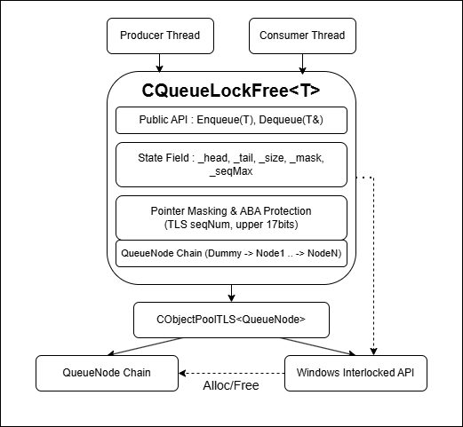

# [LockFreeQueue]

## 1. 개요 (Overview)

| 항목 | 상세 내용 |
| :--- | :--- |
| **요약** | 다수의 스레드가 락(Lock) 없이 데이터를 안전하게 넣고 뺄 수 있는 큐 |
| **핵심 기술** | • **64비트 포인터 마스킹:** 상위 비트 카운터를 적용해 ABA 문제 해결 (Double CAS 대체)<br>• **CAS 연산:** 락 점유 및 대기 시간 감소 |
| **해결 과제** | • 다중 스레드 환경에서 패킷 큐/작업 큐 접근 시 발생하는 동기화 병목 해결<br>• 객체 풀 재사용 시 발생하는 고질적인 ABA 문제 해결 |

🔗 **[관련 문서: 노드 풀 상세 문서 (TLSMemoryPool)](./TLSMemoryPool.md)**

## 2. 왜 필요한가? (Motivation)

*   **기존 락(Lock) 기반 방식의 문제점:** 스레드가 락을 점유한 상태에서 컨텍스트 스위칭이 발생하면, 락을 해제할 때까지 다른 스레드가 기다려야 하는 병목 문제가 발생합니다.
*   **Non-blocking 구조의 이점:** 락 점유 중 컨텍스트 스위칭이 발생하여 진행이 불가능해지는 상황과 달리, 당장 진행이 가능한 다른 스레드가 작업을 계속할 수 있습니다.
*   **구현 목적:** 동기화와 관련된 학습을 위해 직접 구현했습니다.

## 3. 핵심 개념 (Core Concepts)

*   **CAS(Compare-And-Swap) 연산:** 데이터 조작 시 락을 걸어 독점하는 대신, CAS 연산으로 수정을 시도합니다. 다른 스레드가 먼저 수정을 하였다면 실패를 감지하고 처음으로 돌아가 다시 실행합니다.
*   **자료구조 (더미 노드 & 단방향 연결 리스트):** 더미 노드를 1개 유지하여 노드가 존재하지 않는 순간의 동기화 문제를 없앴으며, 한 쪽 방향으로 연결된 리스트 형태를 가집니다.
*   **포인터 마스킹 기반 ABA 방어:** 하위 47비트만 사용하는 x86-64 아키텍처의 구조를 이용하여, 상위 17비트에 카운터를 두어 ABA 문제를 방지합니다. 노드를 할당받아 스레드 고유의 `seqNum`을 주소 상위 17비트에 마스킹하고, 이후 `head`와 `tail`을 갱신할 때 `seqNum` 변경이나 노드 변경을 감지합니다.

## 4. 구현 상세 (Implementation Details)

### 클래스 구조
*   **책임:** 멀티 스레드 데이터 삽입/출력, ABA 문제 해결, 메모리 할당 병목 감소
*   **상태:** 
    *   `_head`, `_tail`: 큐의 시작과 끝을 가리키는 포인터
    *   `_mask`: 실제 사용하는 주소를 뽑아내기 위한 마스크
*   **동작:** 
    *   **삽입 (Enqueue):** 스레드 고유의 `_seqNum`을 증가시키고 노드의 주소 상위 17비트에 이를 적용한 뒤, CAS 연산을 이용하여 `_tail` 뒤에 연결합니다.
    *   **출력 (Dequeue):** `_head`의 다음 노드(`next`)에서 데이터를 읽고, `_head`를 `next`로 이동시킵니다.

### 주요 메서드
*   `Enqueue(T)`: 데이터를 큐에 삽입
*   `Dequeue(T&)`: 데이터를 큐에서 추출



## 5. 사용 예시 (Usage Examples)

```cpp
CQueueLockFree<int> q;
q.Enqueue(1);

int ret;
q.Dequeue(ret);
```

## 6. 기술적 도전과 해결 (Technical Challenges)

멀티스레드 환경의 작동 방식을 추적하기 위해 Enqueue/Dequeue 시 순간적인 큐의 상태(`head`, `tail`, `node`, `node->next` 등)를 메모리에 기록했습니다. 이를 통해 문제의 범위를 좁히고 가설을 도출하여 검증하는 방식으로 디버깅을 진행했습니다.

*   **[문제 1] 노드가 객체 풀에 2번 들어가는 문제 (head 역전)**
    *   **증상:** `head`가 `tail`을 역전하는 현상 발생. `tail`의 `next`가 이전에 사용하던 주소 값을 가리켜 `head`가 엉뚱한 노드를 참조하고 Dequeue를 진행하게 됨.
    *   **해결:** Dequeue 시 늘 `head`의 `next`가 `tail`이 아닌지 확인 후 진행.
*   **[문제 2] `_size` 변수와 실제 큐의 상태 불일치**
    *   **증상:** Dequeue 시 ABA 문제가 발생하여, 노드의 상태가 변경되기 전의 `next`로 `head`를 옮기게 되어 큐의 상태가 꼬이는 문제 발생.
    *   **해결:** 상위 비트 마스킹으로 캡쳐한 `head`의 변경을 감지할 수 있도록 함.
*   **[문제 3] 큐 내부에 데이터가 있으나 Dequeue가 실패(무한 대기)하는 문제**
    *   **증상:** Enqueue 시 `tail`의 `next`에 연결하는 CAS는 성공하였으나 `tail`을 옮기는 CAS가 실패함. A 스레드가 연결을 완료한 순간, B 스레드가 A 스레드의 노드 뒤에 연결을 성공함. A 스레드는 자신이 바라보던 노드로 `tail`을 옮겼으나, B 스레드는 `tail`이 변경되어 CAS에 실패. 이로 인해 `tail`이 밀리지 않아 Dequeue가 실패하고 무한 대기 상태에 빠짐.
    *   **해결:** Enqueue 시 `tail`에 `next`가 존재하여 넣을 수 없을 때 `tail`을 `tail->next`로 변경하여 넣을 수 있는 상태를 만듦. 또한 Dequeue 시 `tail`을 역전 할 수 없는 상태이지만 `tail`의 `next`가 존재한다면 `tail`을 `tail->next`로 변경 후 Dequeue를 시도 함.
    *   **기타:** 락 프리 큐의 노드의 TLS 풀 이용으로 넣으려는 큐가 아닌 다른 큐에 넣게되는 상황이 발생할 수 있음. 따라서 Enqueue 시 `tail`을 옮기는 작업 이후 `tail->next`를 NULL로 설정하여 Enqueue 하는 방식으로 변경. `tail->next`만 보고 연결하게 된다면 보고 있던 노드는 다른 큐에 들어간 상태일 수도 있다.

## 7. 트레이드오프 (Trade-offs)

*   **장점:** 컨텍스트 스위칭이 자주 일어나는 환경에서 락 점유에 의한 대기를 피할 수 있습니다.
*   **단점:** 컨텍스트 스위칭이 자주 일어나는 환경이 아니라면 락을 걸고 사용하는 것이 더 빠릅니다.
*   **적합한 사용 케이스:** 스레드의 개수가 논리 프로세서의 개수보다 많으며, 모든 논리 프로세서가 100% 일을 하고 있어 컨텍스트 스위칭이 빈번하게 일어나는 환경.

## 8. 향후 개선 방향 (Future Improvements)
*(필요 시 추가 작성 예정)*
