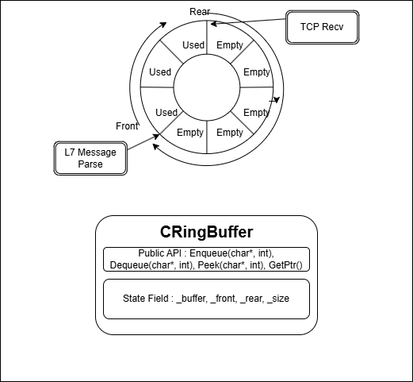

# [RingBuffer]

## 1. 개요 (Overview)

| 항목 | 상세 내용 |
| :--- | :--- |
| **요약** | TCP 스트림 데이터를 논리적인 패킷 단위로 조립하거나 모아서 처리하기 위한 **네트워크 계층(L7) 순환 버퍼(Circular Buffer)** |
| **핵심 기술** | • **Zero-Copy 수신:** `DirectEnqueueSize`와 포인터 캡처를 활용한 직접 수신<br>• **SPSC (Single-Producer Single-Consumer) 최적화:** 특정 조건 하에서 락 없는 동작 지원 |
| **해결 과제** | • **수신 (Recv):** TCP의 스트림 특성(패킷 분할/병합)으로 인한 미완성 메시지 임시 저장 및 완전한 패킷 조립<br>• **송신 (Send):** 잦은 시스템 콜(Send) 호출에 따른 성능 병목 방지를 위한 데이터 배치(Batch) 모음 |

## 2. 핵심 개념 (Core Concepts)

*   **원형 큐(Circular Queue) 자료구조:** 배열의 끝에 도달하면 다시 처음으로 돌아오는 환형 구조를 채택하여, 메모리의 물리적인 이동이나 재할당 없이 연속적인 데이터 스트림을 바이트 단위로 넣고 뺄 수 있습니다.
*   **투포인터 (Front / Rear) 접근:** `_front` (데이터를 꺼낼 위치)와 `_rear` (데이터를 삽입할 위치) 커서를 독립적으로 관리하여 큐의 상태를 추적합니다.

## 3. 구현 상세 (Implementation Details)

### 클래스 구조
*   **책임:** 네트워크 수신 시 바이트 스트림을 임시 저장하고, 완전한 패킷으로 조립하기 위한 메모리 공간 제공
*   **상태:** 
    *   `_buffer`: 데이터가 저장되는 동적 할당 메모리
    *   `_front`: 데이터를 읽어갈(Dequeue/Peek) 커서 위치
    *   `_rear`: 새 데이터를 쓸(Enqueue) 커서 위치
    *   `_size`: `_buffer`의 전체 할당 크기
*   **작동 규칙:** 생성 시 단 1회 `_buffer`를 메모리에 할당하고 소멸 시 해제합니다. 얕은 복사로 인한 이중 해제(Double Free)를 방지하기 위해 복사 생성자 및 대입 연산자를 막아두었습니다.

### 주요 메서드
*   `GetUseSize()`, `GetFreeSize()`: 현재 큐의 사용 중인 공간과 남은 여유 공간의 크기를 반환합니다.
*   `DirectEnqueueSize()`, `DirectDequeueSize()`: 버퍼가 원형으로 꺾이는 경계를 고려하여, 메모리 주소가 **물리적으로 연속되어 있어 한 번에 I/O 작업이 가능한 최대 크기**를 반환합니다.
*   `Enqueue(char* data, int size)`: 지정한 문자열을 큐에 삽입하고, `_rear`를 이동시킵니다.
*   `Dequeue(char* dest, int size)`: 큐에서 지정한 크기만큼 데이터를 읽어오고 `_front`를 이동시킵니다.
*   `Peek(char* dest, int size)`: 데이터를 읽어오되, 데이터를 소모하지 않으므로 `_front`를 이동시키지 않습니다. (주로 패킷 헤더 확인 용도)
*   `GetBufferPtr()`, `GetFrontBufferPtr()`, `GetRearBufferPtr()`: 기본 버퍼 시작 주소, 현재 `_front`, 현재 `_rear`의 메모리 포인터를 반환합니다.
*   `MoveRear(int size)`, `MoveFront(int size)`: 실제 데이터 복사 없이 논리적인 커서(`_rear`, `_front`)만 전진시킵니다.
*   `Lock()`, `Unlock()`: 내부 `SRWLOCK` 객체를 래핑(`AcquireSRWLockExclusive`, `ReleaseSRWLockExclusive`)하여 필요 시 스레드 동기화를 수행합니다.



## 4. 사용 예시 (Usage Examples)

### 기본 사용법 (데이터 복사 발생)
```cpp
char buffer[MAX_BUFFER_SIZE];
CRingBuffer ringbuffer;

// 메시지 수신 후 버퍼에 삽입
int recvSize = recv(socket, buffer, sizeof(buffer), 0);
ringbuffer.Enqueue(buffer, recvSize);

// 완성된 메시지 체크 (헤더 길이 확인)
char header[HEADER_SIZE];
ringbuffer.Peek(header, HEADER_SIZE);
if (header->len <= ringbuffer.GetUseSize()) {
    ringbuffer.Dequeue(buffer, header->len);
}
```

### 고급 사용법 (Zero-Copy 기반 직접 수신)
```cpp
CRingBuffer ringbuffer;

// 메시지 수신 시 링버퍼의 연속된 빈 공간 포인터를 직접 전달 (메모리 복사 감소)
int recvSize = recv(socket, ringbuffer.GetRearBufferPtr(), ringbuffer.DirectEnqueueSize(), 0);
ringbuffer.MoveRear(recvSize);

// 완성된 메시지 체크
char header[HEADER_SIZE];
ringbuffer.Peek(header, HEADER_SIZE);
if (header->len <= ringbuffer.GetUseSize()) {
    ringbuffer.Dequeue(buffer, header->len);
}

// -------------------------------------------------------------
// WSARecv와 Scatter-Gather(WSABUF)를 활용한 경계면 동시 수신 처리
WSABUF wsabuf;[1]
int bufCnt = 1;

wsabuf.buf = ringbuffer.GetRearBufferPtr();
wsabuf.len = ringbuffer.DirectEnqueueSize();

// 링버퍼 끝에서 꺾여 앞쪽에 남은 공간이 있다면 두 번째 버퍼로 지정
if (ringbuffer.GetFreeSize() > ringbuffer.DirectEnqueueSize()) {
    wsabuf.buf = ringbuffer.GetBufferPtr();[2]
    wsabuf.len = ringbuffer.GetFreeSize() - ringbuffer.DirectEnqueueSize();[2]
    bufCnt = 2;
}

// 배열의 꺾인 공간까지 한 번의 시스템 콜로 수신 가능
WSARecv(socket, wsabuf, bufCnt, ...);
```

## 5. 기술적 도전과 해결 (Technical Challenges)

*   **[문제] 멀티스레드 환경에서의 안전성 확보**
    *   기본적인 링버퍼는 여러 스레드가 동시 접근할 경우 커서(`_front`, `_rear`)가 꼬일 위험이 있어 `SRWLOCK`을 래핑하여 동기화 기능을 제공했습니다.
*   **[최적화] 단일 생산자-단일 소비자(SPSC) 모델에서의 Lock-Free 처리**
    *   네트워크 수신부의 특성상 I/O 스레드가 데이터를 넣고(Enqueue), 로직 스레드가 데이터를 빼는(Dequeue) **1:1 구조**가 자주 발생합니다. 이 경우 삽입과 추출이 서로 독립적인 커서를 수정하므로 동시 작동을 허용할 수 있다고 판단했습니다.
*   **[해결] 로컬 변수 캡처를 통한 가시성(Visibility) 제어**
    *   동기화 객체 없이 동작할 때 가장 큰 문제는 함수 실행 도중 컨텍스트 스위칭으로 인해 큐의 상태가 실시간으로 변할 수 있다는 점입니다. 이를 방지하기 위해 함수 진입 시점의 `_front`와 `_rear` 값을 **지역 변수로 캡처(스냅샷)** 하여 로직을 수행하도록 설계했습니다. 이를 통해 큐의 상태가 도중에 변하더라도 캡처된 안전한 스냅샷을 기준으로 동작하여 무결성을 유지할 수 있었습니다.

## 6. 트레이드오프 (Trade-offs)

*   **장점:** TCP 스트림의 특성으로 인해 발생하는 미완성 패킷을 임시로 들고 있거나, 조립하는 로직을 매우 직관적이고 효율적으로 처리할 수 있습니다.
*   **단점:** 구조상 추출(Dequeue)한 데이터를 실제로 비즈니스 로직에서 사용하려면, 객체나 다른 버퍼(예: 직렬화 버퍼)로의 복사가 한 번 필수적으로 발생합니다.
*   **적합한 사용 케이스:** 네트워크 패킷 수신부 및 조립 파이프라인.

## 7. 향후 개선 방향 (Future Improvements)
*(필요 시 추가 작성 예정)*
