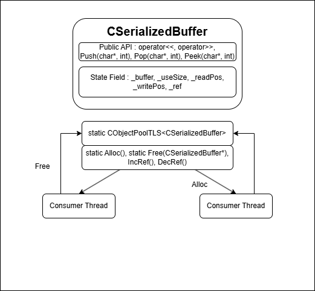

# [SerializedBuffer]

## 1. 개요 (Overview)
- 패킷의 헤더와 바디를 하나의 연속 버퍼에 담아 직렬화/역직렬화를 처리하는 버퍼 클래스, 자체 할당/해제 기능을 제공하는 버퍼 풀
- 네트워크 패킷 조립 시 발생하는 반복적인 memcpy, 헤더와 바디 조립의 번거로움을 해결할 수 있다.
- 참조 카운트를 활용하여 버퍼 생명 주기와 재사용을 관리

## 2. 핵심 개념 (Core Concepts)
- 하나의 버퍼 안에서 읽기, 쓰기 위치를 이동시키며 데이터를 소비/생성한다. 
- 선형 버퍼, 오프셋 기반 커서 이동 방식. 오브젝트 풀 기반 인스턴스 재사용(Alloc, Free). 참조 카운트 기반 수명 관리(IncRef, DecRef)
- <<, >> 연산자를 이용하여 값을 넣고 뺄 수 있다. Push/Pop 메서드를 이용하여 바이트 단위로 데이터를 넣고 뺄 수 있다.
- 사용자 정의 클래스 및 구조체에 대하여 연산자 오버라이딩으로 간단한 사용이 가능하다.

## 3. 구현 상세 (Implementation Details)
- 클래스 구조
  - 책임 : 패킷 단위의 직렬화/역직렬화 버퍼 제공, 헤더와 바디를 한 버퍼에서 관리, 수명 관리 규칙 강제
  - 상태 : _buffer(데이터 저장 주소), _bufferSize(버퍼 크기), _useSize(유효 데이터 크기), _readPos/_writePos(읽기, 쓰기 위치), _ref(참조 카운트), pool(버퍼 풀, static), encoded(인코딩 여부)
  - 작동 : Alloc으로 할당을 받아 Clear로 초기화 이후 사용한다. << 또는 Push 메서드로 데이터를 넣을 수 있고, SetHeader로 만든 헤더를 적용한다.
- 주요 메서드
  - <<, >> : 기본 타입에 대해 오버라이딩되어 데이터를 넣거나 뺄 수 있는 연산자
  - Push(char*, int), Pop(char*, int) : 포인터로 넣은 버퍼에 넣은 크기만큼 데이터를 넣거나 뺄 수 있다. _readPos, _writePos를 이동시킨다.
  - Peek(char*, int) : 포인터로 넣은 버퍼에 넣은 크기만큼 데이터를 확인할 수 있다. _readPos를 이동시키지 않는다.
  - SetHeader(char*) : 포인터로 넣은 버퍼를 헤더 크기만큼 복사하여 헤더 데이터에 넣는다.
  - SetUseSize(int) : 사용중인 크기를 임의로 설정한다.
  - GetHeaderPtr/GetBufferPtr() : 헤더 위치의 포인터, 바디 위치의 포인터를 반환한다.
  - static Alloc()/Free(CSerializedBuffer*) : 풀에서 버퍼의 포인터를 할당/반환한다. Free 시 _ref가 0이 되어야 풀에 반환한다.



## 4. 사용 예시 (Usage Examples)
- 기본 사용법
  ```
  CSerializedBuffer* buffer = CSerializedBuffer::Alloc();
  buffer->Clear();

  char* header[HEADER_SIZE];
  buffer->SetHeader(header);

  short type = 2;
  long long id = 1;
  *buffer << type << id;

  send(socket, buffer->GetHeaderPtr(), buffer->GetHeaderSize() + buffer->GetUseSize(), 0);

  ////////////////////////////////////////////////////

  short type;
  long long id;
  *buffer >> type >> id;

  switch (type) {
    case ...:
      break;
  }
  
  ```
- 고급 사용법
  ```
  CSerializedBuffer* buffers[BUFFER_COUNT];
  WSABUF wsabuf[BUFFER_COUNT];

  for (int i = 0; i < BUFFER_COUNT; i++) {
    wsabuf[i].buf = buffers[i]->GetHeaderPtr();
    wsabuf[i].len = buffers[i]->GetHeaderSize() + buffers[i]->UseSize();
  }

  WSASend(socket, wsabuf, ...);
  ```
  
## 5. 기술적 도전과 해결 (Technical Challenges)
- 네트워크에서 콘텐츠 코드로 버퍼로 메시지를 제공하게 되어 완벽한 분리를 할 수 없다. 따라서 클래스 차원에서 관리를 하여 참조 카운트 기반으로 실질적인 해제를 진행한다. 또한 버퍼가 필요할 때마다 매번 동적 할당/해제를 하게 된다면 속도 또한 느려질 수 있다.
- 풀로 관리하여 동적 할당/해제를 매번 하는 것이 아니라 버퍼의 재사용을 통해 성능 향상을 기대한다.

## 6. 트레이드오프 (Trade-offs)
- 장점 : 콘텐츠 프로그래머 입장에서는 매우 간단한 코드로 패킷 조립/사용을 할 수 있다.
- 단점 : 사용자 정의 클래스/구조체에 대해서 필요 없는 정보도 전달하여 네트워크 트래픽이 더 발생할 수 있다.
- 적합한 사용 케이스 : 네트워크 메시지, 스레드 메시지 등

## 7. 향후 개선 방향 (Future Improvements)
- 

