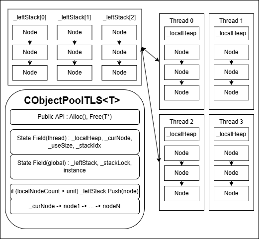

# [TLSMemoryPool]

## 1. 개요 (Overview)

| 항목 | 상세 내용 |
| :--- | :--- |
| **요약** | 멀티스레드 환경에서 락(Lock) 경합 없이 객체를 빠르게 할당하고 재사용하기 위해 **스레드 로컬 스토리지(TLS)** 를 활용한 전용 메모리 풀 |
| **핵심 기술** | • **TLS 기반 로컬 풀:** 스레드 간 락 경합 없는 독립적인 메모리 관리<br>• **침습성 리스트(Intrusive List):** 별도의 노드 할당 없이 객체 메모리 주소 연산만으로 리스트 구성 |
| **해결 과제** | • 런타임 `new/delete`에 의한 디폴트 힙(Heap) 경합 및 오버헤드 완화<br>• Lock-Free 자료구조 구현 시 발생하는 Use-after-Free(이미 해제된 메모리 접근) 방어 |

## 2. 왜 필요한가? (Motivation)

*   **기존 방식의 한계 (디폴트 힙 병목):** 다중 스레드 환경에서 런타임에 잦은 `new`/`delete`가 발생하면, OS의 디폴트 힙에서 락 경합(Lock Contention)이 발생하여 전체 성능이 급격히 저하됩니다. 기존의 전역(Global) 메모리 풀 역시 풀 자체에 접근하기 위한 동기화 비용이 발생합니다.
*   **STL 컨테이너의 한계:** `std::queue`나 `std::list`를 사용할 경우, 데이터를 넣을 때마다 내부적으로 노드 생성을 위한 동적 할당이 필연적으로 발생하므로 병목을 피할 수 없습니다.
*   **Lock-Free 알고리즘과의 결합:** 락프리 자료구조를 직접 `new`/`delete`로 구현할 경우, 다른 스레드가 아직 참조 중인 노드가 OS로 반환되어 접근 위반(Access Violation) 크래시가 발생하는 문제가 있었습니다. 이를 해결하기 위해 메모리를 OS에 반환하지 않고 **풀 내에서만 순환시키는 구조**가 필수적이었습니다.

## 3. 핵심 개념 (Core Concepts)

*   **다단계 풀링 구조 (로컬 힙 & 분배용 풀):**
    *   각 스레드는 락 없이 접근 가능한 자신만의 **로컬 풀(Local Pool)** 을 가집니다.
    *   특정 스레드의 로컬 풀에 메모리가 과도하게 쌓이면(특정 임계치 초과), 다른 스레드들이 가져다 쓸 수 있도록 락을 걸고 **분배용 풀(Shared Stack)** 에 반납합니다.
    *   메모리가 부족할 경우, 가장 먼저 분배용 풀을 확인하고, 그래도 없으면 스레드 전용 로컬 힙(Local Heap)을 통해 메모리를 새로 할당합니다.
*   **침습성 리스트 (Intrusive List):** 할당된 객체 메모리 공간 앞단에 다음 노드를 가리키는 포인터를 강제로 내장시키는 방식입니다. 이로 인해 풀 관리를 위한 별도의 노드 래퍼(Wrapper) 클래스를 동적 할당할 필요가 없어 성능이 극대화됩니다. 반환(`Free`) 시에는 데이터 포인터에서 일정 오프셋(Offset)을 빼서 원래의 노드 포인터를 계산해 보관합니다.
*   **안전 장치:** 버퍼 언더플로우/오버플로우 감지용 마커 삽입, 풀 식별자를 통한 타 메모리 풀로의 잘못된 반환 방지 기능이 포함되어 있습니다.

## 4. 구현 상세 (Implementation Details)

### 클래스 구조
*   **책임:** 지정한 타입(T) 객체의 할당 및 보관, 런타임 스레드 힙 경합 완화, 남는 메모리의 스레드 간 분배.
*   **상태:**
    *   `instance`: 동일 타입에 대해 하나의 분배용 구조만 존재하도록 하는 싱글톤 객체
    *   `leftStack`: 남는 노드를 모아두고 타 스레드가 가져갈 수 있게 하는 분배용 공유 스택
    *   `_curNode`: 현재 스레드의 로컬 풀(Top 노드 포인터)
    *   `_leftNode`: 로컬 풀 반환 시 임계치를 초과한 잉여 노드를 모아두었다가 `leftStack`에 한 번에 넘기기 위한 임시 큐
    *   `stackIdx`: 스레드별 식별 인덱스
    *   `_allocUnit`: 스레드 간 공유 및 일괄 할당의 기준이 되는 단위 개수(Chunk Size)
*   **동작:** 사용자는 `Alloc()`을 통해 객체의 포인터를 받고, 사용이 끝나면 `Free(T*)`를 통해 자신의 로컬 풀에 반환합니다.

### 주요 메서드
*   `Init()`: 스레드 생성 시 호출하여 TLS 데이터 및 로컬 힙을 초기화합니다.
*   `Alloc()`: 로컬 풀 -> 분배용 큐 -> 로컬 힙 동적 할당 순으로 메모리를 확보하여 반환합니다.
*   `Free(T* ptr)`: 메모리를 로컬 풀에 반환합니다. 로컬 풀이 임계치를 초과하면 청크 단위로 묶어 분배용 스택으로 보냅니다.
*   `AllocNewNode()`: 사용 가능한 남은 메모리가 전혀 없을 때 로컬 힙을 통해 새롭게 메모리를 할당합니다.
*   `GetTotalSize()`: OS로부터 동적 할당한 총 메모리(노드) 개수를 반환합니다.
*   `GetUseSize()`: 현재 스레드의 로컬 풀에 보관 중인 대기 상태의 노드 개수를 반환합니다.



## 5. 사용 예시 (Usage Examples)

```cpp
// 1. 서버 구동 또는 스레드 진입 시 TLS 초기화 필수
CObjectPoolTLS<StackNode> pool;
pool.Init(); 

// 2. 메모리 할당 (Lock-Free 동작)
StackNode* node = pool.Alloc();

// ... 노드 활용 로직 ...

// 3. 메모리 반환 (OS에 반납하지 않고 로컬 풀로 돌아감)
pool.Free(node);
```

## 6. 트레이드오프 (Trade-offs)

| 구분 | 설명 |
| :--- | :--- |
| **장점** | 멀티스레드 환경에서 메모리 할당/해제 시 락 대기가 거의 발생하지 않아(Zero Contention) 속도가 비약적으로 빠릅니다. |
| **단점** | 스레드별로 여유분의 메모리를 각각 보유하므로, 중앙에서 하나로 관리하는 단일 풀(Global Pool) 방식에 비해 **전체 메모리 사용량이 필연적으로 더 높습니다.** |
| **적합한 환경** | 초당 수십만 번의 삽입/삭제가 일어나는 네트워크 패킷 버퍼, 락프리 큐의 노드 풀, 세션 관리 등 잦은 할당이 발생하는 핫패스(Hot Path). |

## 7. 향후 개선 방향 (Future Improvements)
*(필요 시 추가 작성 예정)*
