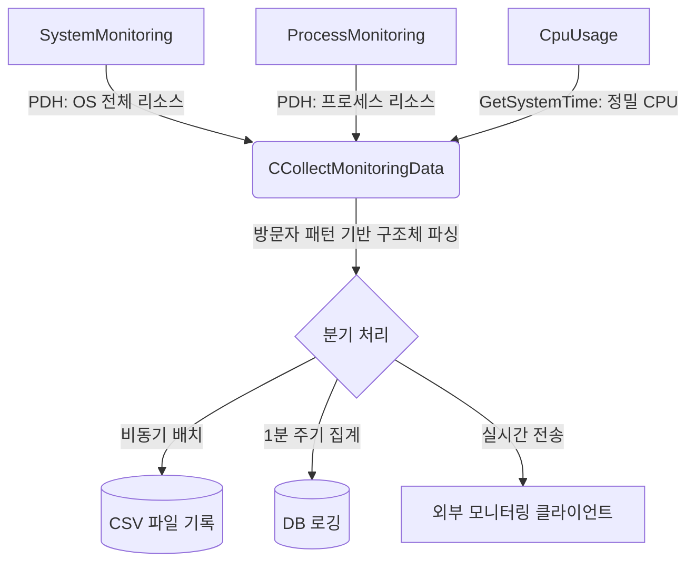

# 📊 모니터링 시스템 (Monitoring & Profiling)

## 1. 개요 (Overview)

| 항목 | 상세 내용 |
| :--- | :--- |
| **요약** | 서버의 핵심 리소스(CPU, 메모리, 네트워크 등)를 실시간으로 측정 및 기록하여 병목과 장애 원인을 분석하는 자체 제작 모니터링 컴포넌트 |
| **해결 과제** | • 장시간 더미 클라이언트 부하 테스트 시 발생하는 메모리/핸들 누수 추적<br>• 특정 접속자 구간에서 발생하는 병목 및 한계치 파악<br>• 무거운 외부 프로파일러에 의존하지 않는 독립적인 상시 모니터링 환경 구축 |
| **핵심 가치** | • **Low Overhead:** 수집 작업 자체가 서버 본연의 성능(Throughput)에 미치는 영향 최소화<br>• **Observability:** CSV 출력 및 DB 로깅을 통한 데이터 시각화와 직관적인 지표 분석 |

---

## 2. 수집 아키텍처 및 데이터 흐름 (Architecture & Flow)

각 수집 모듈이 주기적으로 OS로부터 데이터를 폴링(Polling)하고, 이를 중앙 집중형 클래스가 모아 파일 구조체로 변환한 뒤 디스크에 비동기/배치 방식으로 기록하거나 DB에 로깅합니다.



---

## 3. 핵심 컴포넌트 (Core Components)

### 3.1. SystemMonitoring & ProcessMonitoring
Windows의 **PDH (Performance Data Helper) API**를 기반으로 작동하며, OS 전체 상태와 서버 프로세스의 단일 상태를 분리하여 수집합니다.

*   **주요 수집 지표**
    *   **System:** 전체 CPU 사용량, 코어별 CPU 사용량, 메모리, Non-Paged Pool 메모리
    *   **Process:** 프로세스 전체 CPU 사용량, User-Mode CPU 사용량, 프로세스 핸들(Handle) 개수, 스레드 개수, Non-Paged Pool 메모리
*   **설계 포인트**
    *   매번 쿼리를 동적으로 생성하지 않고, 초기화 시점에 `PdhAddCounter`로 핸들을 캐싱해 둡니다. 이후 주기적으로 `PdhCollectQueryData`만 호출하여 수집 오버헤드를 크게 낮췄습니다.

### 3.2. CpuUsage (GetSystemTime 기반)
PDH를 배제하고 Windows API인 `GetSystemTimeAsFileTime`과 `GetProcessTimes`를 직접 호출하여 CPU 사용률을 독자적으로 계산하는 모듈입니다.

### 3.3. CCollectMonitoringData (데이터 파이프라인)
위 모듈들에서 수집한 Raw 데이터를 약속된 `Struct` 규격으로 변환하고, Excel이나 외부 툴(Python Pandas, Grafana 등)에서 쉽게 파싱할 수 있도록 CSV 형식으로 출력합니다. `visit_struct` 라이브러리를 이용하여 C++ 구조체 멤버 변수의 이름을 동적으로 추출(Reflection 흉내)하여 CSV 헤더로 자동 생성합니다.

*   **의존성:** `visit_struct.hpp` [GitHub 링크](https://github.com/cbeck88/visit_struct/blob/master/include/visit_struct/visit_struct.hpp)

#### 📝 사용 예시
```cpp
// 1. 저장할 구조체 정의
struct MyStruct {
    uint64_t ts;
    float cpus;
    float mem;
    uint32_t sessions;
};

// 2. visit_struct 매크로에 구조체 정보 등록 (CSV 헤더명으로 추출됨)
VISITABLE_STRUCT(MyStruct, ts, cpus, mem, sessions);

// 3. 모니터링 객체 생성 (파일명 지정)
CCollectMonitoringData<MyStruct> mon("new.csv");

int main()
{
    MyStruct s;
    s.ts = timeGetTime();
    s.cpus = 66.6;
    s.mem = 44.4;
    s.sessions = 1234;
    
    // 4. 데이터 저장 (내부적으로 버퍼링 후 쓰기)
    mon.Save(s);
}
```

#### 📄 출력 결과 (new.csv)
| no | ts | cpus | mem | sessions |
| :---: | :---: | :---: | :---: | :---: |
| 1 | 232323 | 66.6 | 44.4 | 1234 |
| 2 | ... | ... | ... | ... |

---

## 4. 적용 사례 및 성과 (Use Cases & Results)

이 모니터링 시스템을 기반으로 서버 인프라의 가시성을 확보하고 운영 효율성을 높였습니다.

**1. 독립적인 모니터링 서버를 통한 실시간 상태 추적**
*   개발자나 관리자가 운영 중인 서버 호스트에 직접 접속(RDP 등)하지 않고도 외부에서 서버 상태를 확인할 수 있도록 별도의 모니터링 서버 노드를 구축했습니다.
*   구동 중인 각 서버들은 로컬의 모니터링 Agent 역할을 하여 수집한 성능 데이터를 실시간으로 모니터링 서버에 전송합니다.

**2. 사후 분석을 위한 서버 상태 DB 로깅**
*   특정 시점에 발생한 서버 지연이나 장애(Crash) 원인을 사후에 정확히 파악하기 위해 모니터링 데이터를 데이터베이스(DB)에 로깅합니다.
*   디스크 I/O를 최소화하기 위해 1분 주기로 데이터를 수집 및 집계(Aggregation)하며, 각 지표 타입별로 최소/최대/평균 값을 요약하여 저장하도록 최적화했습니다.
