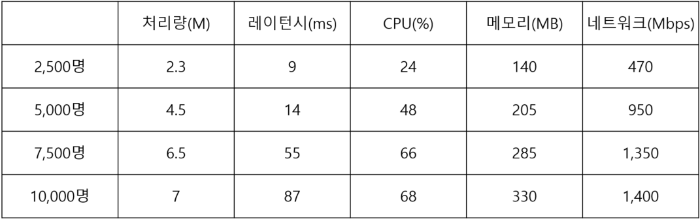

# [Network Library] - 고성능 네트워크 라이브러리

## 1. 개요 (Overview)
   - 직접 제작한 Windows IOCP 기반 네트워크 라이브러리이다.
     
   

## 2. 목차 (Table of Contents)
   - [주요 특징](#3-주요-특징-key-features)
   - [아키텍쳐](#4-아키텍처-architecture)
   - [핵심 컴포넌트](#5-핵심-컴포넌트-core-components)
   - [API 사용법](#6-api-사용법-usage)
   - [성능](#7-성능-performance)
   - [기술 스택](#8-기술-스택-tech-stack)
   - [사용 사례](#9-사용-사례-use-cases)
   - [기술적 의사 결정](#10-기술적-의사결정-technical-decisions)
   - [제한 사항](#11-제한사항-및-알려진-이슈-limitations)
   - [관련 문서](#12-관련-문서-related-documents)

## 3. 주요 특징 (Key Features)
   - 비동기 I/O : 완료 통지 기반 IOCP 이용, 동기 I/O가 일어날 수 있는 환경에서 Zero-Copy 옵션 제공으로 비동기 I/O 제공
   - 멀티스레드 지원 : 멀티스레드 환경 동기화 제공, 콘텐츠 쪽에서 총 스레드의 개수와 Concurrent 스레드의 개수를 지정 가능
   - 패킷 직렬화 : 세션별 최대 1번의 Recv 처리로 메시지의 직렬화를 보장
   - 세션 관리 : IoCount 기반 세션 생명 주기 관리
   - 에러 처리 : 콜백 함수를 이용한 콘텐츠 쪽 알림

## 4. 아키텍처 (Architecture)
   ### 4.1 전체 구조
      - 레이어 다이어그램 (Application → Library API → Core Components)
   
   ### 4.2 스레드 모델
   - IOCP Worker Thread 구조 : IOCP를 통해 Session 객체, Overlapped 객체, 전송 바이트 수를 받는다. 이후 받은 Overlapped 객체와 Session 객체 내부의 Overlapped 객체를 비교하여 Send/Recv에 대한 완료 통지를 구분한다. Recv 완료 통지에 대해서는 RingBuffer에 데이터를 받았으니 Rear를 옮긴 후 RingBuffer 내부의 데이터를 하나의 메시지로 조립하여 OnRecv 콜백을 호출한다. RingBuffer에 완성된 메시지가 더 이상 없다면 비동기 WSARecv를 걸고 마무리한다. Send 완료 통지에 대해서는 전송한 CSerializedBuffer를 모두 Free 한 후, 세션의 _sendQ를 확인하여 다시 WSASend를 호출한다. 각 I/O 작업이나 참조 시 IoCount를 증가시키며, 완료 통지의 최하단에서 IoCount를 줄이며 0이 될 시 세션의 삭제를 진행한다.
   - 스레드 개수 및 역할 : AcceptThread * 1, TPSThread * 1, IOCPThread * N
     -> AcceptThread : 루프를 돌며 계속 세션을 Accept 한다. 세션 연결 시 OnConnectRequest로 접속 여부를 확인하고 접속에 성공하고 세션 정보를 만들었다면 OnConnected 콜백을 호출한다.
     -> TPSThread : 패킷 송수신, Accept 정보를 매 초 저장한다.

## 5. 핵심 컴포넌트 (Core Components)
   ### 5.1 직렬화 버퍼
   - 간단한 설명 (2-3줄) : 프로토콜에 맞추어 바이트 단위로 메시지를 조립할 때 사용한다. 특정 클래스에 대한 오버라이딩으로 콘텐츠 로직 구현 시 간단하게 메시지 조립이 가능하다.
   - 핵심 API 예시
   ```
   virtual void OnRecv(long long sessionId, CSerializedBuffer* buffer) {
      char packetType;
      long long accountNumber;

      *buffer >> packetType >> accountNumber;

      switch(packetType) {
      ...
      }

      SendPacket(sessionId, buffer);
   }
   ```
   - **[상세 문서](./Components/SerializedBuffer.md)**
   
   ### 5.2 수신용 링버퍼
   - 간단한 설명 : 바이트 스트림을 하나의 메시지 단위로 만들기 위해 미완성된 메시지를 들고 있는 환형 큐이다. 
   - 핵심 API 예시
   ```
   WSABUF buf;
   buf.buf = recvQ.GetRearBufferPtr();
   buf.len = recvQ.DirectEnqueueSize();

   WSARecv(session->socket, &buf, ...);

   ----------------------------------------
   CSerializedBuffer* buffer = CSerializedBuffer::Alloc();
   buffer->Clear();
    
   int packetSize;
   recv.Peek(&packetSize, sizeof(int));
   buffer->Push(recvQ.GetFrontBufferPtr(), packetSize);
   OnRecv(session->id, buffer);
   ```
   - **[상세 문서](./Components/RingBuffer.md)**
   
   ### 5.3 송신용 락 프리 큐
   - 간단한 설명 : 직렬화 버퍼(SerializedBuffer)를 메시지 단위로 가지고 있는 락 프리 큐이다. 동기화 객체 없이 CAS 연산을 통해 삽입과 삭제를 수행한다.
   - 핵심 API 예시
   ```
   void SendPacket(long long sessionId, CSerializedBuffer* buffer) {
      Session* session = FindSession(sessionId);

      session->msgQ.Enqueue(buffer);
   }

   void SendPost(Session* session) {
      while (1) {
         CSerializedBuffer* buffer;
         session->msgQ.Dequeue(buffer);
         ...
      }

      WSASend(session->socket, wsabuf, ...);

      }
   ```
   - **[상세 문서](./Components/LockFreeQueue.md)**
   
   ### 5.4 TLS 메모리풀
   - 간단한 설명 : 직렬화 버퍼 및 락 프리 큐의 노드와 같이 많이 사용되는 자원에 대해서 미리 할당을 하여 동적 할당/해제에 소모되는 시간을 줄이기 위해 만든 메모리 풀이다. TLS를 이용하여 스레드 별 힙을 이용하여 디폴트 힙의 경합을 줄이고 스레드 간 경합을 줄인다.
   - 핵심 API 예시
   ```
   void Enqueue(T data) {
      QueueNode* node = pool.Alloc();
      node.data = data;
      ...
      tail->next = node;
      tail = node;
   }

   T Dequeue() {
      QueueNode* head = head;
      head = head->next;

      T returnData = head->data;
      pool.Free(head);
      return returnData;
   }
   ```
   - **[상세 문서](./Components/TLSMemoryPool.md)**

## 6. API 사용법 (Usage)
   ### 6.1 기본 사용법
   - 서버 초기화 코드
   ```
   int main() {
      MyLanServer server;
      server.Start(L"127.0.0.1", SERVER_PORT, TOTAL_THREAD, CONCURRENT_THREAD, MAX_SESSION, IS_ENCRYPT, IS_NAGLE, IS_ZEROCOPY);
   }
   ```
   - 콜백 구현 예시
   ```
   class MyLanServer : public CNetServer {
      bool OnConnectionRequest(long ipAddress, short port) {
         // White Ip 시스템 이용 가능
         return true;
      }

      void OnClientConnected(long long sessionId) {
         // 콘텐츠 플레이어와 세션 매핑
         PLAYER* newPlayer = new Player;
         InitPlayer(newPlayer);
         _playerMap.insert({sessionId, newPlayer});
      }

      void OnClientDisconnected(long long sessionId) {
         auto it = _playerMap.find(sessionId);
         if (it != _playerMap.end())
            delete (*it).second;
         _playerMap.erase(sessionId);
      }

      void OnRecv(long long sessionId, CSerializedBuffer* buffer) {
         // 메시지 처리
         auto it = _playerMap.find(sessionId);
         if (it != _playerMap.end()) {
            char packetType;
            *buffer >> packetType;

            switch(packetType) {
               ...
            }
         }
         CSerializedBuffer::Free(buffer);
      }

      void OnError(ServerError err, int errCode, LPCWSTR errorText) {
      // 에러 로깅 또는 처리
         Log(errCode, errText);
      }
   };
   ```

   ### 6.2 설정 옵션
   - IOCP Worker 스레드 개수, IOCP Concurrent 스레드 개수
   - Nagle, ZeroCopy, Encrypt 옵션

## 7. 성능 (Performance)
   ### 7.1 벤치마크 환경
   - 하드웨어 스펙
      > CPU : Intel Xeon E5-2680 v4 @2.40GHz (14 Core, 28Thread)
      
      > Memory : 16GB(2400MHz)
      
      > SSD : Samsung SSD 850 EVO 120GB
      
      > LAN : Intel I210 Gigabit Network(Inner), Realtek PCIe GBE Family Controller(Outer)
   - OS 및 컴파일러 버전
      > OS : Windows Server 2019 Standard Evaluation
      
      > Compiler : MSVC 19.44.35222

   ### 7.2 벤치마크 결과
   - [성능 분석 문서](./Performance.md)

## 8. 기술 스택 (Tech Stack)
   - 언어 및 버전 : C++ 17
   - 플랫폼 : Windows
   - 빌드 도구 : Microsoft Visual Studio 2022

## 9. 사용 사례 (Use Cases)
- [로그인 서버](../2.%20Servers/LoginServer/README.md)
- [채팅 서버](../2.%20Servers/ChatServer/README.md)

## 10. 기술적 의사결정 (Technical Decisions)
### 10.1 IOCP 선택 이유
   - 문제 : MMORPG 게임 서버에서는 수 많은 인원을 처리해야 한다. 그러나 기존의 Windows 소켓 모델들은 사용할 때 불편하거나 구조적 한계가 존재한다. Select와 WSAEventSelect 모델은 한 번에 관리할 수 있는 소켓의 수가 64개로 제한되어 모든 소켓을 순회하며 상태를 체크해야 하는 단점이 존재한다. 다음으로 WSAAsyncSelect는 Windows의 메시지 루프에 종속되어 멀티 스레드로 게임 서버를 설계하기 어렵다는 단점이 존재한다. 또한 접속이 이루어질 때마다 스레드를 생성하여 처리하는 Concurrent 모델에서는 스레드 콘텍스트 스위칭이 자주 일어날 수 있을 뿐만 아니라 스레드 생성/삭제에 대한 오버헤드가 발생한다.
   - 해결 : Windows IOCP 모델은 위 단점을 대부분 해결하여 편리한 기능을 제공한다. 비동기 입출력의 완료 통지를 통해 다른 작업을 수행할 수 있으며, 직접 스레드 풀을 관리하여 적절한 스레드의 개수를 유지할 수 있다. 소켓을 순회하며 이벤트를 처리하는 방식이 아닌 이벤트 발생 시 작업이 완료된 소켓의 정보를 받아서 즉시 처리가 가능하다.
   - 결과 : 적은 수의 고정된 스레드만으로도 1만 명 이상의 동시 접속을 안정적으로 수용할 수 있는 기반을 마련하였다. I/O 대기 시간과 불필요한 컨텍스트 스위칭의 감소로 CPU 자원을 잘 활용할 수 있게 되었다. 

### 10.2 Zero-Copy 최적화
   - 문제 : TCP의 송신 버퍼 내부에 공간이 남아 있다면 WSASend는 그 즉시 Fast I/O를 통해 송신 버퍼에 데이터를 복사하고 반환한다. 이는 진정한 의미의 비동기 I/O가 아니다. 사용자가 직접 등록한 버퍼를 대상으로 직접 I/O를 하는 Direct I/O가 진정한 의미의 비동기 I/O라고 할 수 있다.
   - 해결 : TCP 송신 버퍼의 크기를 0으로 조절하는 ZeroCopy 기법을 이용한다. 실제 유저가 WSASend의 버퍼로 등록한 메모리에 페이지 락을 걸어 페이지 아웃되는 상황을 방지한다. 이후 드라이버는 등록한 버퍼의 데이터를 읽어서 송신한다.
   - 결과 : 네트워크의 송신량에 따라 성능 결과가 다르다. 네트워크 송신량이 적을 때는 Direct I/O를 위해 버퍼를 등록하는 과정이 송신 버퍼에 복사하는 Fast I/O보다 느리다. 따라서 일정 수준 이상의 네트워크 송신량을 가지고 있을 때 Fast I/O의 복사보다 Direct I/O의 등록 과정이 더 빠른 상황에서 사용할 수 있도록 옵션으로 제공한다. 추가로 TCP의 드라이버는 실제로는 소프트웨어로 이루어져 CPU를 사용하게 되는데, 이 과정에서 서버의 CPU 사용량에 영향을 미치게 될 수도 있기 때문에 무조건 좋다고는 할 수 없다.

## 11. 제한사항 및 알려진 이슈 (Limitations)
- 제한 사항 : CPU 아키텍쳐가 변경되어 64비트 체제가 아니게 되거나 64비트 체제이지만 주소 범위가 증가하여 상위 17비트의 주소를 사용한다면 락 프리 큐의 ABA 문제 해결을 위해 사용하였던 상위 비트 마스킹 기법을 사용할 수 없게 된다.
- 미구현 기능

## 12. 관련 문서 (Related Documents)
- [컴포넌트 상세 문서](./Components)
- [아키텍처 문서](./Architecture.md)
- [성능 분석](./Performance.md)
- [로그인 서버](../2.%20Servers/LoginServer/README.md)
- [채팅 서버](../2.%20Servers/ChatServer/README.md)
