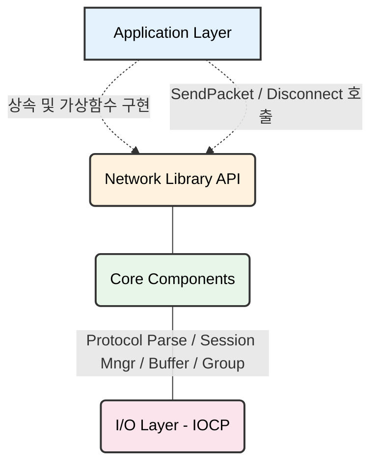
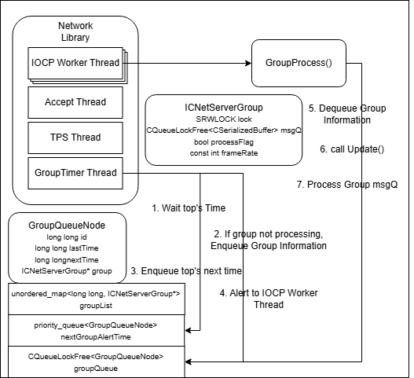
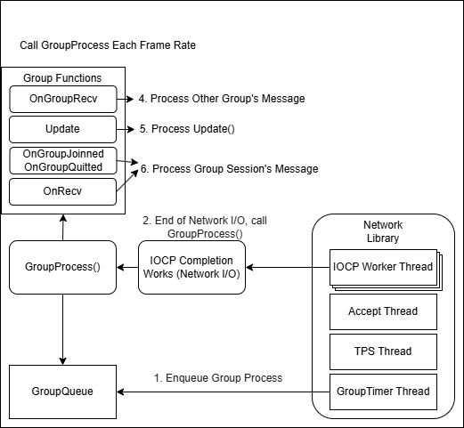

# 🌐 [Network Library] - 자체 제작 C++ 네트워크 라이브러리

## 1. 개요 (Overview)

| 항목 | 상세 내용 |
| :--- | :--- |
| **요약** | 대규모 동시 접속(MMORPG 등) 처리에 최적화된 **Windows IOCP 기반 C++ 네트워크 코어 라이브러리** |
| **목적** | 상용 엔진이나 외부 라이브러리에 의존하지 않고, 비동기 I/O와 동시성 제어의 원리를 100% 직접 제어 |
| **주요 성과** | **10K 동시 접속**, **초당 600만(6M) 패킷 처리**, **평균 지연 85ms** 달성 (상세 지표 하단 참조) |

| 인원 | 처리량(M) | 레이턴시(ms) | CPU(%) | 메모리(MB) | 네트워크(Mbps) |
|:---:|:---:|:---:|:---:|:---:|:---:|
|2,500 | 2.3 | 9 | 24 | 140 | 470 |
|5,000 | 4.5 | 14 | 48 | 205 | 950|
|7,500 | 6.5 | 55 | 66 | 285 | 1,350 |
|10,000 | 7 | 87 | 68 | 330 | 1,400|

## 2. 목차 (Table of Contents)
- [주요 특징](#3-주요-특징-key-features)
- [아키텍처](#4-아키텍처-architecture)
- [핵심 컴포넌트](#5-핵심-컴포넌트-core-components)
- [API 사용법](#6-api-사용법-usage)
- [성능](#7-성능-performance)
- [기술 스택](#8-기술-스택-tech-stack)
- [사용 사례](#9-사용-사례-use-cases)
- [기술적 의사 결정](#10-기술적-의사결정-technical-decisions)
- [제한 사항](#11-제한사항-및-알려진-이슈-limitations)
- [관련 문서](#12-관련-문서-references)

## 3. 주요 특징 (Key Features)
*   **비동기 I/O 모델:** 완료 통지 기반의 비동기 네트워크 송수신 구조. 송신 병목 해소를 위한 **Zero-Copy (Direct I/O)** 활성화 옵션 제공.
*   **스레드 및 동시성 제어:** 멀티스레드 환경의 안전한 데이터 처리를 보장하며, 사용자가 총 워커 스레드 수와 동시 실행(Concurrent) 스레드 수를 유연하게 설정 가능.
*   **패킷 직렬화 보장:** 세션별로 동시에 걸리는 비동기 수신 작업을 단 1회로 엄격히 제한하여 패킷 순서의 정합성 보장.
*   **그룹 기반 실행 컨텍스트:** 인스턴스 던전·필드·PVP 존 등 **컨텐츠 단위로 독립된 그룹을 구성**하고, 그룹 단위로 메시지/로직을 직렬화하여 동일 그룹 내 게임 상태의 일관성을 보장. 그룹은 IOCP 스레드 위에서 안전하게 동시 실행되도록 설계되어, 코어 수에 비례한 자연스러운 스케일 아웃이 가능함.
*   **안전한 세션 관리:** 비동기 I/O 작업의 참조 카운트(IoCount)를 기반으로 세션의 생명주기를 완벽히 통제하여 Use-After-Free 방지.
*   **콜백 기반 에러/이벤트 처리:** 템플릿 메서드 패턴을 활용해 라이브러리 사용자(콘텐츠 개발자)에게 접속/종료/패킷/에러 이벤트를 가상 함수 형태로 전달.

## 4. 아키텍처 (Architecture)

### 4.1 레이어 계층 구조


### 4.2 스레드 모델
*   **스레드 구성:** `AcceptThread (1)` + `TPS/MonitoringThread (1)` + `IOCP Worker Thread (N)`
*   **동작 파이프라인:** 
    *   **AcceptThread:** 루프를 돌며 클라이언트 접속을 수락하고 `OnConnectionRequest`(IP 필터링 등)를 거쳐 세션을 생성한 뒤 `OnClientConnected` 콜백을 호출합니다.
    *   **IOCP Worker Thread:** 커널로부터 `Overlapped` 객체와 전송 바이트 수를 통지받습니다. 
        *   *수신(Recv) 시:* `RingBuffer` 포인터를 갱신하고 완성된 메시지를 조립하여 `OnRecv` 콜백을 호출한 뒤, 다음 `WSARecv`를 예약합니다.
        *   *송신(Send) 시:* 전송 완료된 직렬화 버퍼들을 메모리 풀에 반환(`Free`)하고, 송신 큐(`_sendQ`)에 남은 패킷이 있다면 `WSASend`를 다시 예약합니다.
        *   *세션 정리:* 모든 I/O 작업이 완료되어 `IoCount`가 0으로 떨어지면 안전하게 세션을 회수합니다.

### 4.3 그룹 실행 모델 (Group Execution Model)
네트워크 라이브러리는 **CNetServerGroup / ICNetServerGroup** 추상화를 통해, IOCP 기반 네트워크 코어 위에 **그룹 단위 실행 컨텍스트**를 제공합니다.



*   **그룹의 개념:**
    *   인스턴스 던전, 레이드 파티, 필드 채널, PVP 전장 등 **논리적으로 독립된 게임 공간을 하나의 Group으로 표현**합니다.
    *   각 그룹은 고유한 `frameRate`를 가지며, 초당 N프레임으로 `Update()`와 그룹 메시지 처리 루프(`GroupProcess`)가 호출됩니다.
    *   지정한 frameRate는 최대 프레임 지정으로 내부 메시지 처리나 Update 처리가 늦어진다면 프레임을 보장할 수 없습니다. Update의 처리 시간이 1000ms 이하라면 최소 프레임 1은 보장됩니다. 
*   **실행 구조:**
    *   **CNetServerGroup**는 그룹 전체를 관리하는 매니저 역할을 하며, `RegisterGroup(ICNetServerGroup* p)` 호출을 통해 그룹을 등록합니다.
    *   내부적으로 `GroupTimerThread`가 **타이머 큐(nextGroupAlertTime)** 를 관리하여, 각 그룹의 다음 실행 시점이 되면 그룹 전용 작업 큐(`groupQueue`)에 스케줄링 이벤트를 넣고 IOCP에 신호를 보냅니다.
    *   IOCP 워커 스레드는 `groupQueue`에서 `GroupQueueNode`를 꺼내어 `GroupProcess`를 호출하고, 이 안에서 해당 그룹의 메시지 큐를 순차적으로 비우고(`PopMessage`) `Update()`를 수행합니다.
*   **직렬화(Serialization) 보장:**
    *   그룹 내부에서는 `group->Enter() / Quit()`를 통해 **동시에 단 하나의 스레드만 그룹 로직에 진입**할 수 있습니다.
    *   같은 그룹에 속한 유저들의 `OnRecv`, `OnGroupJoinned`, `OnGroupQuitted`, `Update`는 항상 단일 스레드에서 순차적으로 실행되므로, **보스 HP 감소, 버프 갱신, 아이템 드랍 등 그룹 내 공유 상태가 경쟁 조건 없이 안전하게 유지**됩니다.
*   **세션-그룹 매핑 및 버전 관리:**
    *   `RegisterSessionToGroup(sessionId, groupNumber)` API를 통해 세션을 특정 그룹에 등록/이동할 수 있습니다.
    *   세션 객체에는 `groupVersion` 필드를 두고, 그룹 이동 시마다 이 버전을 증가시킵니다.
    *   그룹 메시지에는 `(sessionId, version)`이 함께 실려 들어가며, `GroupProcess`에서 메시지를 처리할 때 **현재 세션의 `groupVersion`과 메시지에 담긴 `version`을 비교**하여 과거 그룹에서 늦게 도착한 지연 패킷(예: 이전 필드에서의 공격/이동 패킷)을 자동으로 폐기합니다.
*   **사용 예:**
    *   로그인 후 `MyLanServer::OnRecv`에서 인증이 끝나면 `RegisterSessionToGroup`으로 인던/필드 그룹 번호를 지정합니다.
    *   콘텐츠 서버는 `ICNetServerGroup`을 상속한 `MyGroup` 클래스에서 `OnGroupJoinned`, `OnRecv`, `Update`, `OnGroupQuitted`를 구현하여 해당 그룹(던전/필드)만의 게임 로직을 작성합니다.

## 5. 핵심 컴포넌트 (Core Components)

### 5.1 직렬화 버퍼 (Serialized Buffer)
*   **설명:** 프로토콜 명세에 맞춰 바이트 단위로 메시지를 조립하고 파싱하는 커스텀 버퍼입니다. 연산자 오버로딩(`<<`, `>>`)을 지원하여 콘텐츠 로직 작성이 매우 간편합니다.
*   **[상세 문서](./Components/SerializedBuffer.md)**

### 5.2 링 버퍼 (Ring Buffer)
*   **설명:** TCP 스트림 특성상 쪼개지거나 합쳐져서 오는 바이트 스트림을 온전한 하나의 메시지 단위로 조립하기 위해 사용하는 환형 구조의 수신 전용 큐입니다.
*   **[상세 문서](./Components/RingBuffer.md)**

### 5.3 락 프리 큐 (Lock-Free Queue)
*   **설명:** 동기화 객체(Mutex/SRWLock)의 대기 시간 없이, 64비트 CAS 연산과 포인터 마스킹을 활용해 패킷 버퍼를 안전하게 삽입/추출하는 송신 대기 큐입니다.
*   **[상세 문서](./Components/LockFreeQueue.md)**

### 5.4 TLS 메모리 풀 (Thread-Local Memory Pool)
*   **설명:** 스레드 고유의 로컬 스토리지(TLS)를 활용하여 글로벌 힙(Heap)의 락 경합 없이 직렬화 버퍼나 큐 노드를 O(1)에 할당하고 반환하는 재사용 객체 풀입니다.
*   **[상세 문서](./Components/TLSMemoryPool.md)**

### 5.5 그룹 실행 컨텍스트 (CNetServerGroup / ICNetServerGroup)
*   **설명:** 
    *   네트워크 라이브러리 상에서 인스턴스 던전·필드·PVP 존 등을 **그룹 단위로 분리**하여 관리하는 핵심 컴포넌트입니다.
    *   `ICNetServerGroup`은 각 그룹이 상속받아 구현해야 하는 **콘텐츠 레벨의 추상 베이스 클래스**입니다.
*   **주요 역할:**
    *   **그룹 등록/해제:** `RegisterGroup(ICNetServerGroup* p)`를 통해 새로운 그룹을 등록하면, 내부적으로 그룹 ID 할당, 타이머 큐 등록, 그룹 전용 스레드/작업 스케줄링이 자동으로 설정됩니다.
    *   **메시지 라우팅:** 세션이 특정 그룹에 속한 경우, 해당 세션의 수신 패킷은 `IOCP Worker -> CNetServerGroup -> 해당 그룹의 메시지 큐`를 거쳐 그룹 로직으로 라우팅됩니다.
    *   **그룹 단위 직렬화:** `GroupProcess`에서 `group->Enter()`를 호출하여 그룹 단위 락을 획득한 뒤, 큐에 쌓인 메시지를 FIFO 순서로 처리하고 `Update()`까지 수행한 후 `Quit()`으로 락을 해제합니다. 이 과정에서 **동일 그룹 내의 모든 상태 변경은 항상 직렬화된 순서로 처리**됩니다.
    *   **지연 패킷 필터링:** 세션의 `groupVersion`을 사용하여, 그룹 이동 중 발생할 수 있는 "이전 그룹의 늦게 도착한 패킷"을 필터링하여 게임 상태가 꼬이지 않도록 방어합니다.
*   **콘텐츠 개발자 관점:**
    *   `ICNetServerGroup`을 상속한 `MyGroup` 클래스에서 `OnGroupJoinned`, `OnRecv`, `Update`, `OnGroupQuitted`만 구현하면, 해당 그룹은 **안전한 멀티스레드 환경에서 독립적으로 동작하는 게임 월드**가 됩니다.

## 6. API 사용법 (Usage)

### 6.1 기본 서버 실행 및 이벤트 처리
```cpp
// 1. 라이브러리 코어를 상속받아 콜백 함수를 오버라이딩합니다.
class MyLanServer : public CNetServerGroup {
    bool OnConnectionRequest(long ipAddress, short port) {
        // IP 필터링 (White List 등)
        return true; 
    }

    void OnClientConnected(long long sessionId) {
        // 새 세션과 콘텐츠 플레이어 객체 매핑
        PLAYER* newPlayer = new Player();
        _playerMap.insert({sessionId, newPlayer});
    }

    void OnClientDisconnected(long long sessionId) {
        // 플레이어 객체 정리
        auto it = _playerMap.find(sessionId);
        if (it != _playerMap.end()) {
            delete it->second;
            _playerMap.erase(sessionId);
        }
    }

    void OnRecv(long long sessionId, CSerializedBuffer* buffer) {
        // 패킷 파싱 및 처리
        auto it = _playerMap.find(sessionId);
        if (it != _playerMap.end()) {
            char packetType;
            *buffer >> packetType;

            switch(packetType) {
                // 비즈니스 로직 분기
            }
        }
        // 사용이 끝난 버퍼는 풀로 반환
        CSerializedBuffer::Free(buffer);
    }

    void OnError(ServerError err, int errCode, LPCWSTR errorText) {
        // 로깅 등 에러 처리
        Log(errCode, errorText);
    }
};

// 2. 서버 설정 후 Start 호출
int main() {
    MyLanServer server;
    // IP, Port, Total Worker, Concurrent Worker, Max Session, Encrypt, Nagle, ZeroCopy
    server.Start(L"127.0.0.1", 7777, 10, 8, 10000, false, false, true);
    
    // 메인 스레드 대기 루프
    while(true) { Sleep(1000); }
}
```

### 6.2 그룹 서버 실행

```cpp

long groupNumber;

class MyServer : public CNetServerGroup {
    bool OnConnectionRequest(long ipAddress, short port) {
        // IP 필터링 (White List 등)
        return true; 
    }

    void OnClientConnected(long long sessionId) {
        // 새 세션과 콘텐츠 플레이어 객체 매핑
    }

    void OnClientDisconnected(long long sessionId) {
        // 플레이어 객체 정리
    }

    void OnRecv(long long sessionId, CSerializedBuffer* buffer) {
        // 패킷 파싱 및 처리
        // 비즈니스 로직 분기

        // 콘텐츠 이동 분기
        RegisterSessionToGroup(sessionId, groupNumber);

        // 사용이 끝난 버퍼는 풀로 반환
    }

    void OnError(ServerError err, int errCode, LPCWSTR errorText) {
        // 로깅 등 에러 처리
        Log(errCode, errorText);
    }
};
// MyServer 콜백 함수 구현...
MyServer server;

class MyGroup : public ICNetServerGroup {
public:
	MyGroup(int frame) : ICNetServerGroup(frame) { }

	virtual void OnGroupJoinned(long long sessionId) {
		// sessionId 정보 저장
	}

	virtual void Update() {
		// 프레임마다 호출될 로직
	}

	virtual void OnRecv(long long sessionId, CSerializedBuffer* buffer) {
		// buffer 메시지 처리...
	}

	virtual void OnGroupQuitted(long long sessionId) {
		
	}
};

MyGroup group(500);

int main() {
    // IP, Port, Total Worker, Concurrent Worker, Max Session, Encrypt, Nagle, ZeroCopy
    server.Start(L"127.0.0.1", 7777, 10, 8, 10000, false, false, true);

    groupNumber = server.RegisterGroup(&group);
}
```

## 7. 성능 (Performance)
*   **벤치마크 환경:** Intel Xeon E5-2680 v4 (14C/28T), 16GB RAM, Windows Server 2019
*   **벤치마크 결과 상세:** [성능 분석 문서](./Performance.md) 참조

## 8. 기술 스택 (Tech Stack)
*   **언어:** C++ 17
*   **플랫폼:** Windows OS (Windows Sockets 2 - IOCP)
*   **개발 환경:** Microsoft Visual Studio 2022

## 9. 사용 사례 (Use Cases)
이 네트워크 라이브러리를 기반으로 제작한 애플리케이션 계층 서버입니다.
*   [로그인 서버 (인증, 중복 로그인 방지)](../2.%20Servers/LoginServer/README.md)
*   [채팅 서버 (다채널 브로드캐스팅, 공간 분할)](../2.%20Servers/ChatServer/README.md)

## 10. 기술적 의사결정 (Technical Decisions)

### 10.1 왜 Windows IOCP를 선택했는가?
*   **문제 (기존 모델의 한계):** `Select`나 `WSAEventSelect`는 한 번에 관리 가능한 소켓 수(64개) 제한이 있고 O(N) 순회 비용이 듭니다. `WSAAsyncSelect`는 Windows 메시지 루프에 종속되어 부적합하며, 접속마다 스레드를 만드는 구조는 컨텍스트 스위칭과 스레드 생성/해제의 오버헤드가 극심합니다.
*   **해결 및 결과:** OS 커널 단에서 스레드 풀링과 비동기 완료 통지를 관리해주는 **IOCP (I/O Completion Port)** 를 채택했습니다. 이를 통해 적은 수(논리 코어 수 수준)의 고정된 스레드만으로 1만 명 이상의 동시 접속을 컨텍스트 스위칭 병목 없이 안정적으로 처리할 수 있는 아키텍처를 완성했습니다.

### 10.2 Zero-Copy 최적화 도입 (Direct I/O)
*   **배경 (Fast I/O의 진실):** 일반적인 환경에서 TCP 송신 버퍼(커널 영역)에 공간이 남아 있다면, `WSASend`는 단순히 유저 데이터를 커널 버퍼로 메모리 복사(`memcpy`)하고 즉시 반환(Fast I/O)합니다. 이는 진정한 의미의 비동기 I/O가 아닙니다.
*   **해결 (Zero-Copy):** 소켓의 송신 버퍼 크기(SO_SNDBUF)를 0으로 설정하여 커널 복사를 원천 차단합니다. 대신 사용자가 전달한 버퍼 메모리에 페이지 락을 걸어 페이징 아웃을 막은 뒤, 네트워크 드라이버가 해당 유저 메모리 주소에서 데이터를 직접 읽어 전송(Direct I/O)하도록 구성했습니다.
*   **결과와 한계 (Trade-off):** 패킷 크기와 송신량이 막대할 때는 메모리 복사 비용을 없애주어 속도 향상을 가져옵니다. 하지만 송신량이 적을 때는 페이지 락을 걸고 푸는 OS 설정 비용이 메모리 복사 비용보다 더 비싸지며 성능이 저하될 수 있습니다. 따라서 이 기능은 네트워크 부하 특성에 맞게 선택할 수 있도록 옵션으로 분리해 두었습니다.

## 11. 제한사항 및 알려진 이슈 (Limitations)
*   **64비트 아키텍처 종속성:** 본 라이브러리의 Lock-Free 큐는 ABA 문제 해결을 위해 64비트 포인터의 상위 17비트 미사용 영역을 마스킹하는 기법을 사용합니다. 따라서 향후 128비트 OS가 나오거나, 가상 메모리 주소 체계가 상위 17비트까지 확장되는 환경에서는 오작동을 일으킬 수 있습니다.

## 12. 관련 문서 (References)
*   [코어 컴포넌트 상세 문서](./Components)
*   [아키텍처 문서](./Architecture.md)
*   [부하 테스트 및 성능 분석](./Performance.md)
