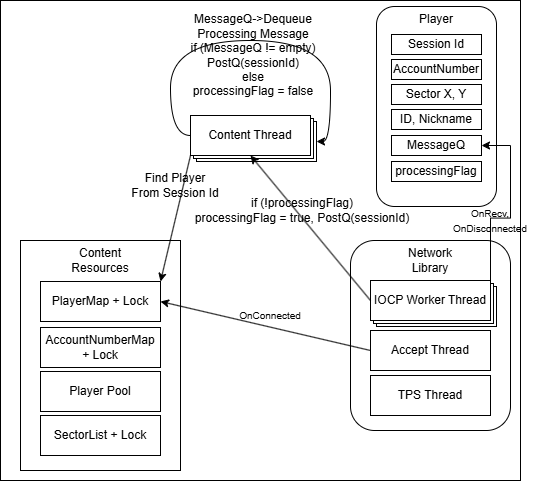
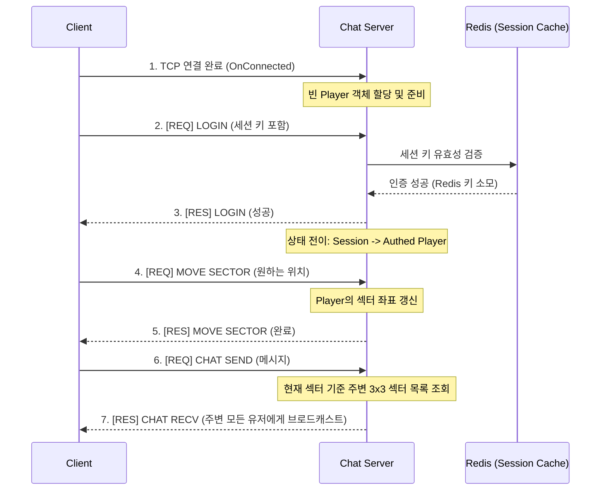
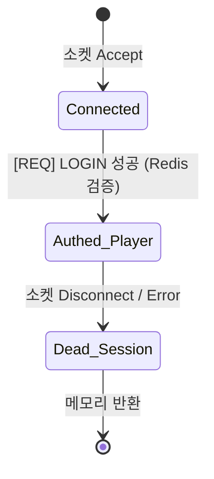

# 💬 [채팅 서버] 아키텍처 및 설계 문서

## 0. 문서 개요 (Overview)

| 항목 | 상세 내용 |
| :--- | :--- |
| **목적** | 자체 네트워크 라이브러리를 활용하여 구현한 그리드(섹터) 기반 채팅 서버의 내부 아키텍처 설명 |
| **핵심 구조** | • **관심사 분리:** 네트워크 I/O 스레드와 비즈니스(콘텐츠) 스레드의 역할 분리 • **공간 분할:** 2D 섹터(Grid) 기반의 범위 브로드캐스팅 및 동시성 제어 |
| **데이터 모델** | Redis 기반의 세션(Session Key) 공유 및 인증 체계 |

## 1. 시스템 아키텍처 (System Architecture)

*   **전체 구성도:** 클라이언트 ↔ 게임 서버군(채팅/로그인 등) ↔ 글로벌 데이터베이스(Redis/MySQL)로 이어지는 유기적인 흐름.
*   **스레드 모델 및 작업 분배 (Job Queue 기반):**
    *   네트워크 라이브러리의 **IOCP Worker 스레드**는 I/O에 집중하며, `OnConnected`, `OnDisconnected`, `OnRecv` 콜백을 통해 이벤트만 애플리케이션 계층으로 전달합니다.
    *   이벤트(콜백)를 수신하면, 패킷을 즉시 처리하지 않고 해당 플레이어 객체 내부의 락프리 큐(Job Queue)에 삽입합니다.
    *   **콘텐츠 스레드**들이 큐에서 패킷(Job)을 꺼내어 실제 비즈니스 로직(이동, 채팅 전파 등)을 병렬로 처리합니다.

## 2. 통신 프로토콜 (Network Protocol)

### 2.1 패킷 구조 (Packet Layout)
*   **공통 헤더 (5 Bytes):** 
    *   `Code(1)` | `Length(2)` | `Random Key(1)` | `CheckSum(1)`

### 2.2 주요 패킷 명세 (API)
*   **[REQ] LOGIN:** `Type(2)`, `AccountNumber(8)`, `Id(40, wchar)`, `Nickname(40, wchar)`, `SessionKey(64)`
*   **[RES] LOGIN:** `Type(2)`, `Status(1)`, `AccountNumber(8)`
*   **[REQ/RES] MOVE SECTOR:** `Type(2)`, `AccountNumber(8)`, `X(2)`, `Y(2)`
*   **[REQ] CHAT SEND:** `Type(2)`, `AccountNumber(8)`, `MessageLength(2)`, `Message(N, wchar)`
*   **[RES] CHAT RECV (브로드캐스트):** `Type(2)`, `AccountNumber(8)`, `Id(40)`, `Nickname(40)`, `MessageLength(2)`, `Message(N, wchar)`

### 2.3 주요 상호작용 시퀀스 (Sequence Diagram)

## 3. 데이터 모델 (Data Model)

### 3.1 RDBMS 스키마 (MySQL) - 인증 참고용
*   `account` 테이블: 계정 관리 (`AccountNumber`, `UserId`, `UserPassword`, `UserNickname`)
*   `status` 테이블: 유저 상태 (`AccountNumber`, `Status`)
*   `whiteIp` 테이블: 접속 허용 IP 목록 (`Number`, `Ip`)

### 3.2 캐시 및 인메모리 구조 (Redis)
*   **세션 공유 아키텍처:** 로그인 서버에서 발급한 인증 토큰을 채팅 서버에서 검증하기 위해 글로벌 캐시를 사용합니다.
*   **Key 네이밍 규칙:** `{AccountNumber}_C` 형식으로 저장 (서버군마다 다른 접미사 `_C`, `_G` 등을 붙여 목적지별 키 분리).
*   **세션 유지(TTL) 정책:** 발급 후 수명은 1분(60초)이며, 채팅 서버 접속 과정에서 한 번 검증(Read)하면 즉시 해당 키를 폐기(Consume)하는 일회성 토큰(OTP) 방식을 채택하여 보안을 강화했습니다.

### 3.3 서버 내부 메모리 모델 (In-Memory Data Structures)
*   **`unordered_map<long long, Player*> playerMap[N]` + `SRWLOCK[N]`**
    *   `SessionId`를 Key로 플레이어 객체를 탐색하는 구조. 해시 충돌과 락 경합(Lock Contention)을 줄이기 위해 배열 맵 형태(N개)로 분할(Sharding)하여 락을 분산시켰습니다.
*   **`unordered_map<long long, long long> accountNumberMap` + `SRWLOCK`**
    *   동일 계정의 중복 접속을 차단하기 위해 `AccountNumber`와 `SessionId`를 매핑하여 관리합니다.
*   **`vector<Player*> sectorList[SECTOR_Y][SECTOR_X]` + `SRWLOCK`**
    *   2D 그리드 공간 상의 특정 섹터에 존재하는 플레이어 포인터들을 관리합니다. 채팅 발생 시 주위 3x3 섹터 리스트를 순회하며 메시지를 전파합니다.
*   **`CObjectPool<PLAYER> playerPool`**
    *   잦은 유저 접속/해제에 따른 메모리 할당 부하를 없애기 위한 플레이어 객체 재사용 풀입니다.

## 4. 핵심 비즈니스 로직 (Core Business Logic)

### 4.1 상태 전이 파이프라인 (State Machine)

### 4.2 동시성 제어 (Concurrency Control)
*   **Job Queue (Actor Model) 방식 패킷 처리:**
    *   수신된 모든 메시지는 각 플레이어 고유의 `MessageQ` (Lock-Free Queue)에 삽입됩니다.
    *   하나의 플레이어 객체는 **한 번에 단 하나의 로직 스레드만 꺼내어 처리**하도록 `ProcessingFlag` 변수에 CAS(Compare-And-Swap) 연산을 적용하여 원자적(Atomic)으로 진입을 제어합니다.
*   **섹터 이동 및 채팅 브로드캐스팅 동기화:**
    *   메시지를 전파하는 도중 플레이어가 섹터를 이동해버리면 **메시지 유실(Loss)이나 중복 수신(Duplication)**이 발생할 수 있습니다. 이를 방지하기 위해 주변 섹터(3x3)에 브로드캐스트를 수행할 때는, 관련된 9개 섹터에 대한 읽기 락을 동시에 획득(Deadlock 회피를 위해 순서 정렬 필수)하여 순간적인 이동 처리를 차단합니다.
*   **I/O Bound 병목 완화 (Redis 연동 시):**
    *   Redis 조회를 수행하는 동안 스레드가 블로킹(대기)되어 다른 클라이언트의 처리가 지연되는 것을 막기 위해, Windows OS 스케줄러가 대기 상태를 감지하면 여분의 스레드를 투입할 수 있도록 전체 워커 스레드 수를 넉넉히 잡고(Total Threads), 동시에 실행 가능한 스레드 수(Concurrent Threads)만 CPU 코어에 맞게 제한하는 전략을 사용했습니다.
