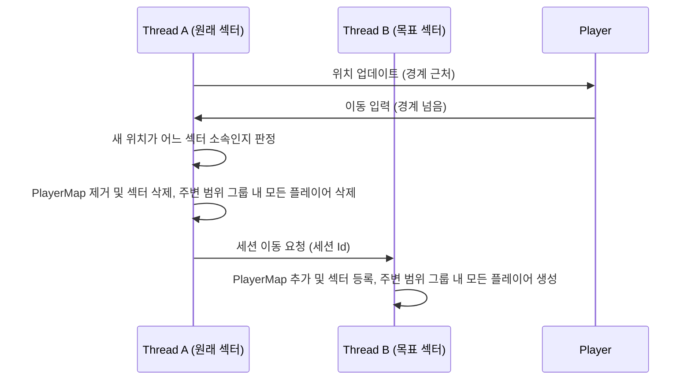
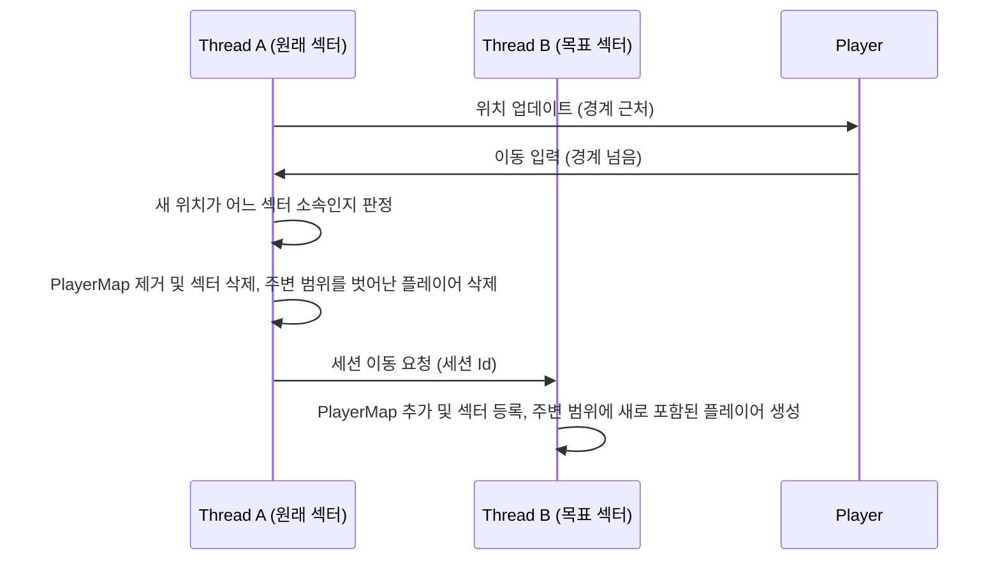
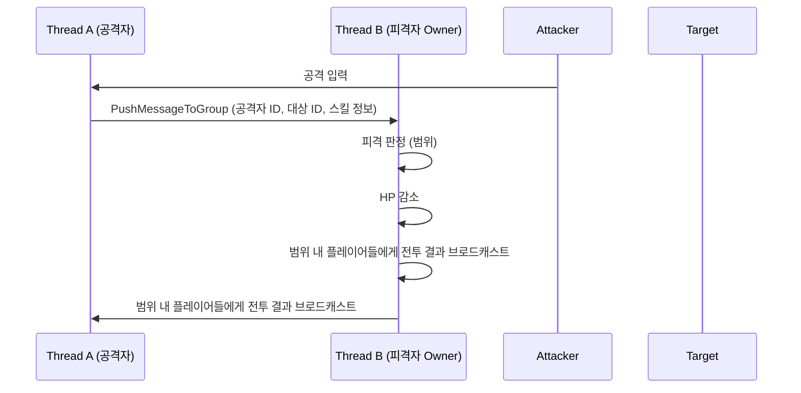
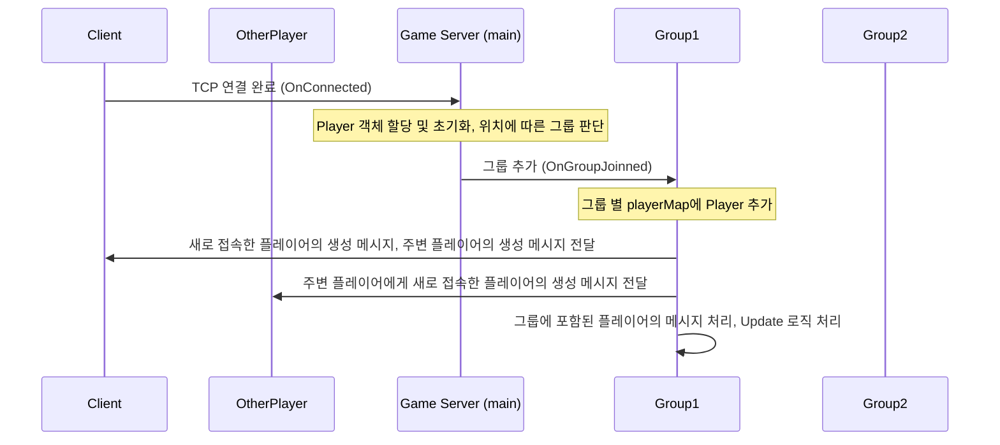
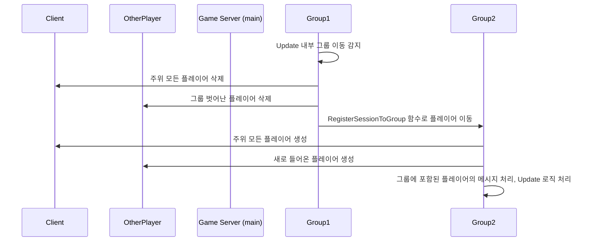
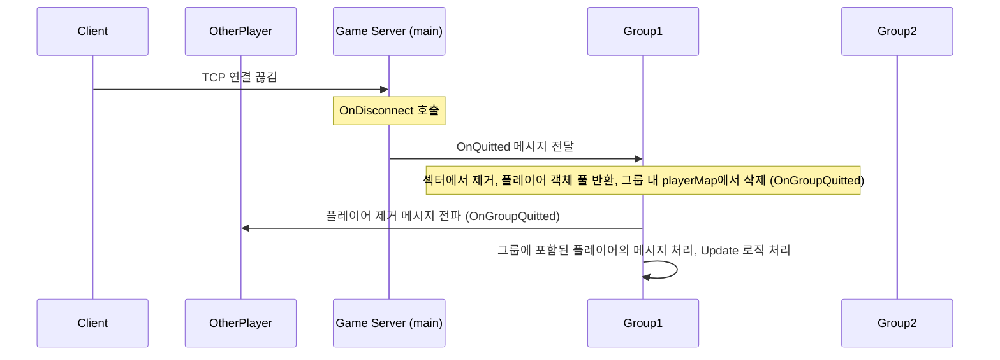

# 🗺️ Game Server Architecture

n × n 격자 공간과 3×3 섹터를 사용하는  
**멀티 스레드 게임 서버 아키텍처 및 동기화 설계 문서**입니다.

---

## 0. 문서 개요

| 항목 | 내용 |
| :--- | :--- |
| **역할** | MMORPG 월드 내 플레이어의 이동·공격을 처리하고, 주변 3×3 섹터의 상태를 실시간으로 동기화하는 전용 게임 서버 |
| **핵심 포인트** | 멀티 스레드 환경에서의 **월드 파티셔닝**, **스레드 간 이동 동기화**, **스레드 간 전투 상호작용** |
| **동기화 단계** | ① 단일 스레드 대륙 기반 서버 → ② 심리스 서버(스레드 간 이동/3×3 전파) → ③ 완전 멀티 스레드 전투 서버(공격/피격 포함) |
| **설계 범위** | n × n 격자 월드 모델, 3×3 AOI 로직, 스레드·데이터 구조, 네트워크 라이브러리와의 통합 방식 |

---

## 1. 월드

### 1.1 격자 월드 구조

- 월드는 **n × n 격자 셀**로 구성되며, 여러 개의 셀을 묶어 **섹터**를 구성합니다.
- 각 플레이어는 하나의 셀에 위치하며, 해당 셀을 포함하는 섹터에 속합니다.
- 서버는 섹터 단위를 기준으로 다음을 수행합니다.
  - 섹터 내부 플레이어 목록 관리
  - 인접 섹터에 대한 브로드캐스트 대상 집합 계산

### 1.2 3×3 섹터

- 플레이어를 기준으로 **현재 섹터를 중심으로 한 3×3 섹터** 범위를 주변 관심 범위로 인식합니다.
- 서버는 각 틱마다:
  - 주변 범위 안에 새로 들어온 플레이어에 대해 **Spawn 이벤트**
  - 주변 범위 밖으로 나간 플레이어에 대해 **Despawn 이벤트**
  를 발생시켜 클라이언트에 전송합니다.
- 이 구조를 통해:
  - 전체 월드의 모든 플레이어 정보를 보내지 않고,
  - **공간적으로 가까운 정보만 제한적으로 전송**하여 네트워크 대역폭을 절감합니다.  
이러한 섹터 기반 3×3 구조는 실제 MMORPG 서버에서 사용하는 전형적인 관심 영역 관리 패턴과 유사합니다.

---

## 2. 스레드 및 파티셔닝 모델

### 2.1 1단계 – 대륙(Continent) 기반 서버

> 스레드 간 공유 데이터 없음, 각 대륙은 독립된 싱글 스레드 월드

#### 2.1.1 스레드 소유권

- 각 섹터는 **고정된 소유 스레드(Owner Thread)** 를 가집니다.
- HP, 이동 방향 등 **상태(State)** 수정은 오직 Owner Thread에서만 수행합니다.
- 다른 스레드가 관리하는 플레이어는 **Read-only** 로만 취급합니다.
- 섹터 경계를 넘어갈 때:
  - 플레이어의 소속 섹터가 바뀌면서, 해당 섹터의 Owner Thread도 함께 변경됩니다.
- **대륙(Continent)** 단위로 섹터를 그룹화하고, 각 대륙을 하나의 스레드가 전담합니다.
  - 예: `Thread 0 → Continent A`, `Thread 1 → Continent B`, ...

#### 2.1.2 경계 이동 흐름

#### 2.1.3 자료 구조

- 전역 자료 구조
  - `std::unordered_map<sessionId, PLAYER*>` worldPlayerMap : 전체 플레이어를 관리하는 맵
  - `SRWLOCK` worldPlayerMapLock : 전체 플레이어 정보 접근 시 이용
- 스레드 자료 구조
  - `SECTOR_AROUND[SECTOR_SIZE_X][SECTOR_SIZE_Y]` sectorAround : 주위 섹터의 좌표를 저장
  - `SECTOR_AROUND[SECTOR_SIZE_X][SECTOR_SIZE_Y][8]` prevSectorAround : 8방향 이동에 따라 사라지거나 추가되는 주변 섹터 좌표 저장
  - `SECTOR_AROUND[SECTOR_SIZE_X][SECTOR_SIZE_Y][2]` attackAround : 2방향 공격에 따라 공격 판정을 계산해야 하는 주변 섹터 좌표 저장
  - `std::unordered_map<sessionId, PLAYER*>` playerMap : 네트워크 라이브러리의 sessionId와 PLAYER 객체를 저장
  - `std::vector<PLAYER*>[SECTOR_SIZE_X][SECTOR_SIZE_Y]` sectorList : 각 섹터에 어떤 플레이어가 들어있는지 저장
  - `OnGroupJoinned()`, `OnGroupQuitted()`, `OnRecv()`, `Update()` 인터페이스

#### 2.1.4 장단점

- **장점**
  - 락 없이 단일 스레드 내에서만 데이터가 변경되므로, 동기화 문제가 사실상 존재하지 않습니다.
- **제한**
  - 대륙 단위가 아닌, 서로 인접한 지역 단위로 보다 세밀하게 관리하고 싶을 때는 부자연스럽거나 유연성이 떨어질 수 있습니다.

### 2.2 2단계 – 심리스(Seamless) 서버: 스레드 간 이동 동기화

> 스레드 간 **경계 이동** 및 **3×3 섹터 생성/삭제 이벤트** 처리

#### 2.2.1 경계 이동 흐름

- 차이점 : “그룹 내 플레이어” 정보만 전파하던 단계에서, **주변 모든 플레이어**의 정보를 전파하는 구조로 확장되었습니다.

#### 2.2.2 자료 구조

- 전역 자료 구조
  - `std::unordered_map<sessionId, PLAYER*>` worldPlayerMap : 전체 플레이어를 관리하는 맵
  - `SRWLOCK` worldPlayerMapLock : 전체 플레이어 정보 접근 시 이용
  - `SECTOR_AROUND[SECTOR_SIZE_X][SECTOR_SIZE_Y]` sectorAround : 주위 섹터의 좌표를 저장
  - `SECTOR_AROUND[SECTOR_SIZE_X][SECTOR_SIZE_Y][8]` prevSectorAround : 8방향 이동에 따라 사라지거나 추가되는 주변 섹터 좌표 저장
  - `SECTOR_AROUND[SECTOR_SIZE_X][SECTOR_SIZE_Y][2]` attackAround : 2방향 공격에 따라 공격 판정을 계산해야 하는 주변 섹터 좌표 저장
  - `std::vector<PLAYER*>[SECTOR_SIZE_X][SECTOR_SIZE_Y]` sectorList : 섹터에 어떤 플레이어가 들어있는지 저장
  - `SRWLOCK[SECTOR_SIZE_X][SECTOR_SIZE_Y]` sectorListLock : 섹터 단위 동기화 객체
- 스레드 자료 구조
  - `std::unordered_map<sessionId, PLAYER*>` playerMap : 네트워크 라이브러리의 sessionId와 PLAYER 객체를 저장
  - `int` sectorX, sectorY : 그룹의 섹터 좌표
  - `OnGroupJoinned()`, `OnGroupQuitted()`, `OnRecv()`, `Update()` 인터페이스

- 차이점 : 섹터 관리가 “그룹(스레드) 내부”에서만 이뤄지던 구조에서, 전역 섹터 구조로 확장되었습니다. 각 그룹은 섹터 좌표를 기반으로 자신이 담당하는 영역을 판단합니다.

#### 2.2.3 장단점

- **장점**
  - 모든 구역의 플레이어와 그 행동을 자연스럽게 전파할 수 있습니다.
- **제한**
  - 공격과 같은 상호작용이 아직 불가능하여, 완전한 게임 플레이 관점에서는 다소 부자연스럽게 느껴질 수 있습니다.

### 2.3 3단계 – 완전 멀티 스레드 전투 서버

> 스레드 간 이동 + **전투 상호작용(공격/피격)** 모두를 일관되게 유지

#### 2.3.1 스레드 간 공격 상호작용

- 핵심 포인트:
  - **공격 판정과 HP 변경은 항상 Target Owner Thread에서만 수행**합니다.

#### 2.3.2 자료 구조

- 상단 심리스 서버(2.2)와 동일한 자료 구조를 사용합니다.
- 차이점 : 그룹 간 메시지 전달 함수를 추가하고 이를 활용하여, 공격/피격 정보를 다른 스레드로 전파합니다.

#### 2.3.3 장단점

- **장점**
  - 모든 구역의 플레이어 행동뿐 아니라 **공격/피격 상호작용**까지 전파할 수 있습니다.
- **제한**
  - 거래와 같이 고려해야 할 요소가 많은 시스템에는 이 방식만으로는 부족할 수 있으며, 별도의 중앙 집중형 처리나 추가적인 설계가 필요합니다.

#### 2.3.4 특이사항

- 거래 시스템 구상
  - 대륙 기반 게임 서버 : 다른 대륙 간 플레이어는 서로 보이지 않으므로, 직접적인 거래 자체를 차단합니다.
  - 심리스/멀티 스레드 기반 게임 서버 : 서로 다른 스레드에 속한 플레이어 간 직접 거래를 차단하고, 클라이언트에는 “더 가까이 접근해야 거래할 수 있다”는 메시지를 표시합니다.
  - 공통 : 우편/거래소와 같은 **중앙 거래 시스템**을 통해 간접 거래를 지원하는 방향으로 설계할 수 있습니다.

---

## 3. 데이터 구조 및 동기화 전략

### 3.1 섹터/플레이어 데이터 구조

- `Sector`
  - 현재 섹터 내 플레이어 리스트
- `Player`
  - 캐릭터 ID, 세션 ID
  - 현재 셀/섹터 좌표, 현재 월드 좌표
  - HP, 이동 방향

### 3.2 동기화 원칙

- **락 범위 축소**
  - 부득이하게 공유 자원을 사용할 경우, 섹터 단위로 락 범위를 최소화하여 경쟁을 줄입니다.
  - 동기화 순서에 따른 데드락을 방지하기 위해, 정해진 순서로 동기화 객체의 소유권을 획득합니다.
- **메시지 패싱 우선**
  - 가능한 한 모든 상호작용(이동, 전투, 상태 변경)을 **Job/Message** 로 표현하여, 해당 로직을 담당하는 스레드가 직접 처리하도록 설계합니다.

---

## 4. 네트워크 라이브러리와의 통합

### 4.1 사용 중인 공통 기능

- 세션 생성/해제 콜백 (`OnConnected`, `OnDisconnected`)
- 완성 패킷 단위의 수신 (`OnRecv`)
- 그룹 이동 콜백 (`OnGroupJoinned`, `OnGroupQuitted`)
- 그룹 프레임 로직 (`Update`)
- 세션 키 기반 플레이어 관리
- TLS 메모리 풀 및 락프리 송신 큐

### 4.2 게임 서버 전용 확장 기능

| 변경점 | 설명 |
| :--- | :--- |
| **Group 로직 통합 처리** | 별도의 전용 스레드에서 로직을 실행하는 것이 아니라, IOCP Worker 스레드의 완료 통지 이후, 처리해야 할 그룹 로직이 있다면 그 시점에 실행합니다. `GroupTimer` 스레드는 지정한 프레임 레이트마다 `GroupQueue`에 처리 대상 그룹 정보를 삽입합니다. |
| **Group 메시지 전달** | 그룹 간 메시지 전달 기능을 추가하여, 다른 그룹(스레드) 간 상태를 동기화할 수 있도록 했습니다. 이를 통해 공격/피격, 이동 등 스레드 간 상호작용을 안전하게 전달합니다. |

---

## 5. 통신 프로토콜

### 5.1 패킷 구조
*   **공통 헤더 (3 Bytes):** 
    *   `Code(1)` | `Length(1)` | `Packet Type(1)`

### 5.2 주요 패킷 명세
*   **[RES] CreateMyCharacter:** `Id(4)`, `See Direction(1)`, `Position(4) - x, y`, `HP(1)`
*   **[RES] CreateMyCharacter:** `Id(4)`, `See Direction(1)`, `Position(4) - x, y`, `HP(1)`
*   **[RES] DeleteCharacter:** `Id(4)`,
*   **[REQ] MoveStart/MoveStop/Attack:** `See Direction(1)`, `Position(4) - x, y`,
*   **[RES] MoveStart/MoveStop/Attack:** `Id(4)`, `See Direction(1)`, `Position(4) - x, y`,
*   **[RES] Damage:** `AttackedId(4)`, `DamagedId(4)`, `DamagedHp(1)`

### 5.3 주요 상호작용 시퀀스

- 접속

- 그룹 이동

- 접속 종료

