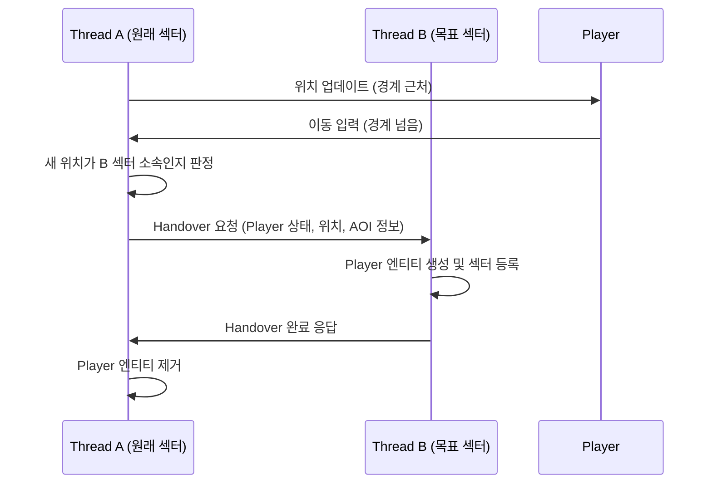
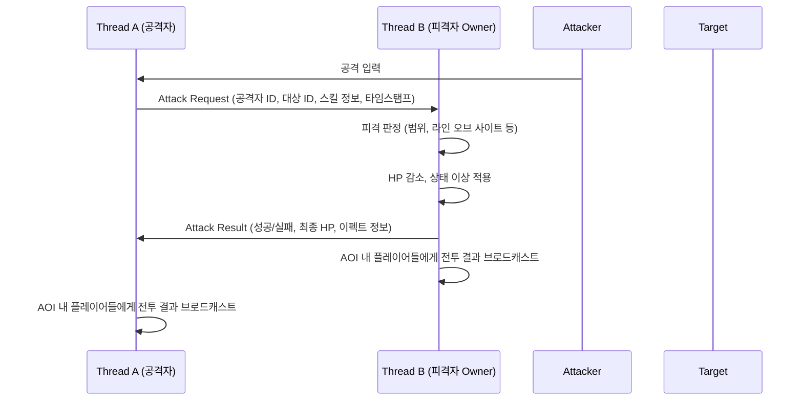

# 🗺️ Game Server Architecture

n × n 격자 공간과 3×3 섹터 기반 AOI를 사용하는  
**멀티 스레드 게임 서버 아키텍처 및 동기화 설계 문서**입니다.

---

## 0. 문서 개요 (Overview)

| 항목 | 내용 |
| :--- | :--- |
| **역할** | MMORPG 월드 내 플레이어의 이동·공격을 처리하고, 주변 3×3 섹터의 상태를 실시간으로 동기화하는 전용 게임 서버 |
| **핵심 포인트** | 멀티 스레드 환경에서의 **월드 파티셔닝**, **스레드 간 이동 동기화**, **스레드 간 전투 상호작용** |

---

## 1. 월드

### 1.1 격자 월드 구조

- 월드는 **n × n 격자 셀** 로 구성되며, 여러 개의 셀을 묶어 **섹터** 를 구성합니다.
- 각 플레이어는 하나의 셀에 위치하며, 해당 셀을 포함하는 섹터에 속합니다.
- 서버는 섹터 단위를 기준으로:
  - 섹터 내부 플레이어 목록 관리
  - 인접 섹터에 대한 브로드캐스트 대상 집합 계산
  를 수행합니다.

### 1.2 3×3 섹터

- 플레이어를 기준으로 **현재 섹터를 중심으로 한 3×3 섹터** 범위를 주변 범위로 인식합니다.
- 서버는 각 틱마다:
  - 주변 범위 안에 새로 들어온 플레이어에 대해 **Spawn 이벤트**
  - 주변 범위 밖으로 나간 플레이어에 대해 **Despawn 이벤트**
  를 발생시켜 클라이언트에 전송합니다.
- 이 구조를 통해:
  - 전체 월드의 모든 플레이어 정보를 보내지 않고,
  - **공간적으로 가까운 정보만 제한적으로 전송**하여 대역폭을 절감합니다.

---

## 2. 스레드 및 파티셔닝 모델

### 2.1 1단계 – 대륙(Continent) 기반 서버

> 스레드 간 공유 데이터 없음, 각 대륙은 독립된 싱글 스레드 월드

- **대륙(Continent)** 단위로 섹터를 그룹화하고, 각 대륙을 하나의 스레드가 전담합니다.
  - 예: `Thread 0 → Continent A`, `Thread 1 → Continent B`, ...
- 서로 다른 대륙으로의 이동을 허용합니다.
- 스레드 내부 구조:
  - `Sector[ ][ ]` 컨테이너
  - `Player` 엔티티 목록
  - 틱 기반 메인 루프 (이동 처리, 충돌, AOI 업데이트)
- **장점**
  - 락 없이 단일 스레드 내에서만 데이터가 변경되므로, 동기화 문제가 사실상 존재하지 않습니다.
- **제한**
  - 대륙 단위가 아닌 붙어있는 지역 단위로 관리 시 부자연스러울 수 있습니다.

### 2.2 2단계 – 심리스(Seamless) 서버: 스레드 간 이동 동기화

> 스레드 간 **경계 이동** 및 **3×3 섹터 생성/삭제 이벤트** 처리

#### 2.2.1 스레드 소유권 (Thread Ownership)

- 각 섹터는 **고정된 소유 스레드(Owner Thread)** 를 가집니다.
- 섹터 경계를 넘어갈 때:
  - 플레이어의 소속 섹터가 바뀌면서,
  - 해당 섹터의 Owner Thread도 함께 변경됩니다.

#### 2.2.2 경계 이동(Handover) 흐름

#### 2.2.3 주변 범위 업데이트

- 스레드 이동 이후, T2는:
  - 새 3×3 섹터 범위에 대해 Spawn/Despawn 목록을 계산
  - 해당 섹터들에 속한 플레이어들의 클라이언트로 브로드캐스트
- 이 때, T1과 T2는 **직접 같은 컨테이너를 공유하지 않고**,  
  스레드 이동 메시지에 포함된 스냅샷 데이터만 전달합니다.

### 2.3 3단계 – 완전 멀티 스레드 전투 서버

> 스레드 간 이동 + **전투 상호작용(공격/피격)** 모두를 일관되게 유지

#### 2.3.1 엔티티 오너십 모델

- 각 플레이어는 하나의 **Owner Thread** 를 가집니다.
- HP, 이동 방향 등 **상태(State)** 수정은 오직 Owner Thread에서만 수행합니다.
- 다른 스레드는 엔티티 상태를 **Read-only** 로만 취급합니다.

#### 2.3.2 스레드 간 공격 상호작용

- 핵심 포인트:
  - **공격 판정과 HP 변경은 항상 Target Owner Thread에서만 수행**합니다.
  - 순서 보장을 위해 각 Attack Request에 **타임스탬프/시퀀스 번호**를 부여할 수 있습니다.
  - 이렇게 하면 락을 여러 곳에 거는 대신, Owner Thread가 단일 직렬화 지점(Serialize Point)이 됩니다.

---

## 3. 데이터 구조 및 동기화 전략 (Data & Synchronization)

### 3.1 섹터/플레이어 데이터 구조

- `Sector`
  - 소유 스레드 ID
  - 현재 섹터 내 플레이어 리스트
- `Player`
  - 캐릭터 ID, 세션 핸들
  - 현재 셀/섹터 좌표
  - Owner Thread ID
  - AOI 캐시(현재 보이는 플레이어 집합)

### 3.2 동기화 원칙

- **공유 메모리 최소화**
  - 스레드 간에 공유되는 것은 가능한 한 `불변 데이터` 또는 `메시지 큐` 뿐입니다.
- **락 범위 축소**
  - 부득이하게 공유 자원을 사용할 경우,  
    섹터 단위 혹은 플레이어 단위의 미세한 락 범위로 나누어 경쟁을 줄입니다.
- **메시지 패싱 우선**
  - 가능한 한 모든 상호작용(이동, 전투, 상태 변경)을 **Job/Message** 로 표현하여,
    해당 로직을 담당하는 스레드가 직접 처리하도록 설계합니다.

---

## 4. 네트워크 라이브러리와의 통합 (Integration with Network Core)

### 4.1 사용 중인 공통 기능

- 세션 생성/해제 콜백 (`OnConnected`, `OnDisconnected`)
- 완성 패킷 단위의 수신 (`OnRecv`)
- 세션 키 기반 세션 관리 (로그인 서버에서 발급받은 키 재검증 가능)
- TLS 메모리 풀 및 락프리 송신 큐

### 4.2 게임 서버 전용 확장 기능

| 변경점 | 설명 |
| :--- | :--- |
| **섹터 브로드캐스트 API** | `(섹터 ID / 3×3 섹터 집합, 패킷)` 을 인자로 받는 브로드캐스트 함수를 추가하여, 게임 서버는 AOI 집합만 계산하고 전송은 네트워크 레이어에 위임합니다. |
| **Game Thread Job Posting** | IOCP 워커 스레드에서 바로 게임 로직을 수행하지 않고, **게임 틱 스레드**로 Job을 투입하는 인터페이스를 추가했습니다. 이를 통해 네트워크 I/O와 게임 로직의 책임을 분리했습니다. |
| **세션 메타데이터 확장** | 세션 구조체에 `World/Continent ID`, `Sector Coord`, `Player ID` 등을 추가하여, 패킷 처리 시 게임 서버에서 별도의 맵 조회 없이 라우팅을 쉽게 할 수 있도록 했습니다. |
| **타임스탬프 지원** | 패킷 헤더 혹은 바디에 서버 측 타임스탬프를 쉽게 삽입할 수 있는 유틸을 제공하여, 공격/이동의 순서 보장 및 롤백/보정 로직에 활용할 수 있도록 설계했습니다. |

---

## 5. 향후 확장 포인트 (Future Work)

- **몹 AI 및 스킬 시스템 통합**
  - 현재 구조 위에 몹 AI, 스킬 이펙트, 투사체(Projectile) 등 복잡한 게임 로직을 올릴 수 있습니다.
- **샤딩(Shard) / 채널링**
  - 동일 월드를 여러 샤드로 나누고, 각 샤드가 위 구조를 그대로 복제하여 대규모 유저 수용 가능.
- **리플레이/로그 시스템**
  - 스레드 간 메시지(Attack Request/Result)를 그대로 로그로 남겨, 디버깅 및 리플레이 시스템에 활용 가능.

---