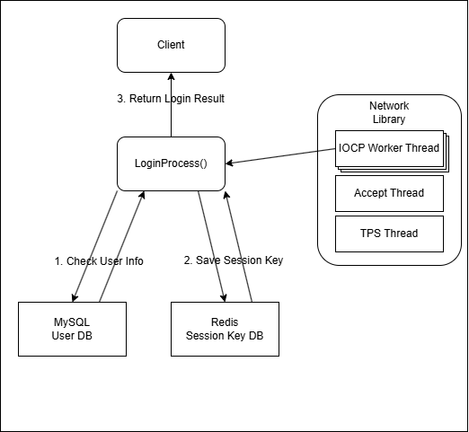
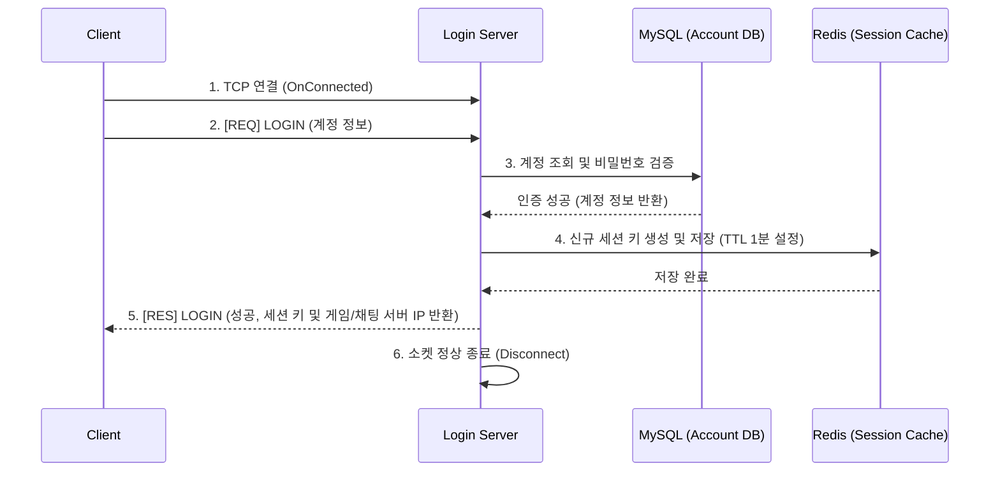
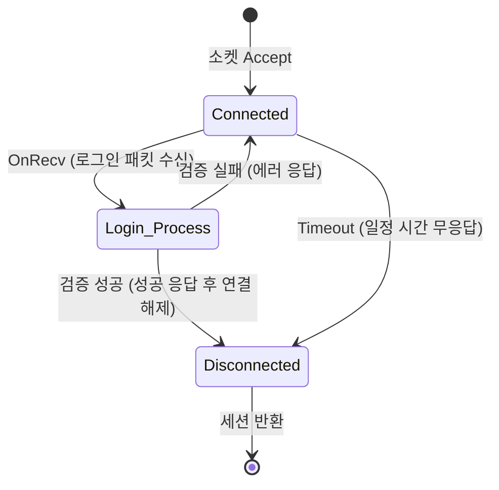

# 🔑 [로그인 서버] 아키텍처 및 설계 문서

## 0. 문서 개요 (Overview)

| 항목 | 상세 내용 |
| :--- | :--- |
| **목적** | 자체 네트워크 라이브러리를 활용하여 구현한 로그인 서버의 아키텍처 설계 |
| **핵심 구조** | • **Stateless 설계:** 서버 내부 메모리를 사용하지 않고 MySQL과 Redis에 100% 의존하여 스케일 아웃 용이 • **동기 I/O 최적화:** DB 접근 시 발생하는 I/O 블로킹 대처를 위한 스레드 풀 및 TLS 커넥션 풀 운용 |
| **데이터 모델** | MySQL 기반 계정 검증 및 Redis 기반 일회성 세션 키(OTP Session) 발급 |

## 1. 시스템 아키텍처 (System Architecture)

*   **전체 구성도:** 클라이언트 ↔ 로그인 서버 ↔ 데이터베이스(Redis/MySQL)로 이어지는 인증 흐름.
*   **스레드 모델 (Direct Execution):** 
    *   네트워크 라이브러리의 **IOCP Worker 스레드**가 `OnConnected`, `OnRecv` 이벤트를 수신하면, 채팅 서버처럼 별도의 잡 큐(Job Queue)로 넘기지 않고 **그 즉시 로그인 처리 함수를 동기적으로 실행**합니다.
    *   **I/O Bound 병목 대처:** 로그인 로직 내부에는 DB 접근(MySQL/Redis)으로 인한 스레드 블로킹(대기)이 필연적으로 발생합니다. 이를 보완하기 위해 **IOCP의 전체 워커 스레드 수를 넉넉하게 생성**하여 일부 스레드가 블로킹되더라도 OS 스케줄러가 남은 스레드를 깨워 다른 유저의 로그인을 처리할 수 있게 설계했습니다. (Concurrent 스레드 수를 통해 CPU 점유율 조절)
*   **의사 결정:** 로그인 서버에서는 IOCP Worker 스레드의 OnRecv 내부에서 즉시 로직을 실행하도록 하였습니다. 로그인 서버의 경우 콘텐츠에서 동기화 객체를 사용하지 않고 DB 조회를 통해 개별적인 처리가 가능합니다. 로그인 서버의 경우 DB 조회를 통해 네트워크 I/O 작업이 중지되더라도 로그인 서버에서 처리하는 패킷의 양이 많지 않기 때문에 직접 처리해도 괜찮다는 판단을 하였습니다.

## 2. 통신 프로토콜 (Network Protocol)

### 2.1 패킷 구조 (Packet Layout)
*   **공통 헤더 (5 Bytes):**
    *   `Code(1)` | `Length(2)` | `Random Key(1)` | `CheckSum(1)`

### 2.2 주요 패킷 명세 (API)
*   **[REQ] LOGIN:** `Type(2)`, `AccountNumber(8)`, `SessionKey(64)` 
*   **[RES] LOGIN:** `Type(2)`, `AccountNumber(8)`, `Status(1)`, `ID(40, wchar)`, `Nickname(40, wchar)`, `GameServerIp(32, wchar)`, `GameServerPort(2)`, `ChatServerIp(32, wchar)`, `ChatServerPort(2)`

### 2.3 주요 상호작용 시퀀스 (Sequence Diagram)

## 3. 데이터 모델 (Data Model)

### 3.1 RDBMS 스키마 (MySQL)
*   `account`: 유저 기본 정보 (`AccountNumber`, `UserId`, `UserPassword(hashed)`, `UserNickname`)
*   `status`: 유저 상태 관리 및 제재 여부 (`AccountNumber`, `Status`)
*   `whiteIp`: 관리자 및 테스트용 접속 허용 IP 목록 (`Number`, `Ip`)

### 3.2 캐시 및 인메모리 구조 (Redis)
*   **Key 네이밍 규칙:** 로그인 서버는 다른 서버(게임, 채팅 등)에서 사용할 수 있도록 목적지별로 별도의 세션 키를 생성하여 Redis에 저장합니다.
    *   `{AccountNumber}_C` : 채팅 서버용 Session Key
    *   `{AccountNumber}_G` : 게임 서버용 Session Key
*   **데이터 만료(TTL) 및 세션 유지 정책:** 로그인 성공 직후 클라이언트가 각 서버로 이동하여 최초 접속 시에만 사용되는 일회성 토큰이므로, 한 번 읽히면 폐기되며 별도의 세션 연장을 지원하지 않습니다.

### 3.3 서버 내부 메모리 모델 (In-Memory Data Structures)
*   **Stateless 아키텍처:** 유저의 모든 영구 데이터는 MySQL에, 휘발성 인증 상태는 Redis에 저장하므로 **로그인 서버 자체의 메모리에는 유저 상태를 보관하지 않습니다.** 이는 로그인 서버의 다중화를 매우 쉽게 만들어줍니다.

## 4. 핵심 비즈니스 로직 (Core Business Logic)

### 4.1 상태 전이 파이프라인 (State Machine)

*   **Timeout 정책:** 의미 없는 연결 유지를 막기 위해, 소켓 연결 후 일정 시간 내에 로그인 패킷을 보내지 않으면 서버에서 선제적으로 세션을 강제 종료합니다.
*   **DB 지연 정책:** DB의 연결, 읽기/쓰기 작업이 느려져 무한 대기를 하는 상황 발생 시 모든 스레드가 대기를 하게 될 수 있습니다. 따라서 DB 연결, 읽기/쓰기 작업 시 일정 시간동안 반응이 없다면 반환될 수 있도록 timeout 옵션을 설정합니다.
*   **DB 재연결 정책:** DB 쿼리 실패 시 조회 쿼리에 한하여 재연결을 1회 시도하고 쿼리 재시도를 진행합니다. SET 쿼리 중복 진행 시 DB 상태가 깨질 수 있습니다.
