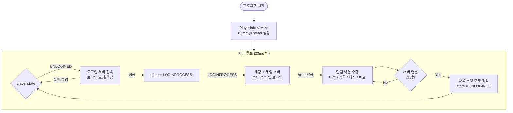

# 🔗 Integration & Demo

서버 3종(로그인·채팅·게임)의 **24시간 장기 안정성 검증** 결과입니다.

---

## 1. 데모 개요 (Overview)

| 항목 | 내용 |
| :--- | :--- |
| **목적** | 전체 시스템 연계 + 장기 안정성 확인 |
| **테스트 대상** | 로그인 → 채팅 → 게임 순차 흐름, 3×3 AOI 동기화, 멀티스레드 전투 |
| **더미 클라이언트** | 5000명 더미 자동 실행 |
| **테스트 기간** | 24시간 무중단 가동 |

---

## 2. 더미 모니터링 항목 (Dummy Monitoring)

더미 클라이언트는 서버별 **연결성·패킷 처리·콘텐츠 안정성**을 실시간 모니터링합니다.

| 항목 | 의미 | 확인 목적 |
|------|------|-----------|
| **Total Connect** | 총 접속 시도 횟수 | 서버 연결 안정성 |
| **Connect Error** | 접속 실패 횟수 | 인증/DB 연동 오류 |
| **Disconnect From Server** | 서버 강제 연결 해제 | 세션 관리 이상 |
| **Session Count** | 현재 활성 세션 수 | 세션 유지 안정성 |
| **Character Count** | (Game) 활성 캐릭터 수 | 월드/AOI 정상 동작 |
| **content error** | 콘텐츠 로직 오류 | 비즈니스 로직 버그 |
| **packet error** | 패킷 파싱 오류 | 프로토콜 호환성 |
| **packet/sec** | 초당 패킷 처리량 | 처리량 및 병목 |
| **Wait for Timeout Session** | 타임아웃 대기 세션 | 비활성 클라이언트 연결 해제 |
| **Sync**| 게임 서버 좌표 동기화 횟수 | Pending 메시지 씹힘 또는 게임 서버 지연 |
| **rtt** | 왕복 지연 시간 | 클라이언트-서버 응답성 |

---

## 3. 더미 작동 흐름



---

## 4. 24시간 테스트 결과

### 4.1 더미 모니터링 결과 (누적)
| 서버 | Total Connect | content/packet error | Sync |
|------|---------------|---------------|------------|
| **Login** | **48,277,670** | **0/0** | **None** |
| **Chat**  | **48,211,584** | **0/0** | **None**|
| **Game**  | **48,211,584** | **0/0** | **0** |

**추가 지표**: RTT **44ms**, Total Packet **8,845,928,657**

### 4.2 리소스 사용량
| 서버 | CPU 평균(%) | 메모리 변동(MB) | RecvTps | SendTps | AcceptTps |
|------|------------|----------------|---------|----------|------------|
| **Login** | 4.2 | +7.7 | 558 | 558 | 558 |
| **Chat**  | 6.2 | +34.7 | 4890 | 23248 | 558 |
| **Game**  | 10.4 | +7.5 | 4511 | 78616 | 558 |

**✅ 24시간 무중단. 오류 0건,**

---

## 5. 검증된 핵심 기능

| 기능 | 상태 | 24h 결과 |
|------|------|----------|
| **세션키 연속성** | ✅ | 세션키를 이용한 96,423,168건 로그인 성공 |
| **스레드 간 이동** | ✅ | Pending 메시지 손실 0건 |
| **패킷 처리** | ✅ | 오류 0건, TPS 안정 |

---

## 6. 문제 해결 사례 (게임 서버)

### 그룹 이동 방식 변경에 따른 메시지 전달 오류
- **원인 :** 이전 그룹 메시지 처리를 위해 GROUP_QUIT 메시지에서 그룹을 실질적으로 변경하고, 새 그룹에 GROUP_JOIN을 하는 방식
- **문제 :** 그룹 1 -> 그룹 2 -> 그룹 3으로 빠르게 이동 시도 시 그룹 1의 QUIT -> 그룹 2의 JOIN -> 그룹 2의 QUIT -> 그룹 3의 JOIN이 이루어져야 하지만, 그룹 2의 QUIT -> 그룹 3의 JOIN -> 그룹 1의 QUIT -> 그룹 2의 JOIN으로 순서가 꼬이는 문제가 발생할 수 있었다.
- **해결 :** 최종적으로 그룹의 이동을 수행하는 MoveGroup에서는 그룹을 변경하는 코드를 넣지 않고, 그룹 변경 요청 순서에 따라 적용되도록 하였다. 또한 JOIN이 발생하지 않았지만 QUIT이 오는 문제 해결을 위해 그룹 별로 어떤 세션이 JOIN을 했는지 체크를 하여 필터링 하였고, JOIN 메시지를 동일 그룹에 2번 넣을 수 있는 문제는 이동하려는 그룹과 현재 그룹을 비교하여 필터링 하였다.

```cpp
void CNetServerGroup::MoveGroup(long long sessionId, int groupNumber, long ver) {
    Session* session = _sessionMap[GetIdx(sessionId)];
    // 세션 유효성 체크

    AcquireSRWLockShared(&groupLock);
    ICNetServerGroup* group = nullptr;
    auto it = groupList.find(groupNumber);
    if (it != groupList.end()) 
        group = it->second;
    ReleaseSRWLockShared(&groupLock);
    if (!group) {
        ReleaseSession(session);
        return;
    }

    AcquireSRWLockExclusive(&session->groupLock);
    // 그룹 버전 체크로 이전 메시지는 처리하지 않음
    if (session->groupVersion == ver) {
        CSerializedBuffer* b = CSerializedBuffer::Alloc();
        b->Clear();
        *b << (char)ICNetServerGroup::GROUPJOIN << sessionId;
        session->group->msgQ.Enqueue(b);
    }

    // 요청 기준으로 그룹 처리
    //session->group = group;
    ReleaseSRWLockExclusive(&session->groupLock);

    ReleaseSession(session);
}

void CNetServerGroup::GroupProcess() {
    while (1) {
        CSerializedBuffer* buf = 0;
        group->msgQ.Dequeue(buf);
        if (!buf)
            break;

        char type;
        long long sessionId;
        
        long newGroup;
        long ver;
        *buf >> type >> sessionId;

        switch (type) {
        case ICNetServerGroup::GROUPJOIN:
            ...
            break;
        case ICNetServerGroup::GROUPQUIT:
            *buf >> newGroup >> ver;
            // 현재 처리하는 이 그룹에서 JOINNED가 호출되었는지 알 수 있어야 함.
            if (group->joinnedSet.erase(sessionId))
                group->OnGroupQuitted(sessionId);
            MoveGroup(sessionId, newGroup, ver);
            CSerializedBuffer::Free(buf);
            break;
        case ICNetServerGroup::ONRECV:
            ...
            break;
        }
    }
}
```

---

## 7. 서버 데이터


