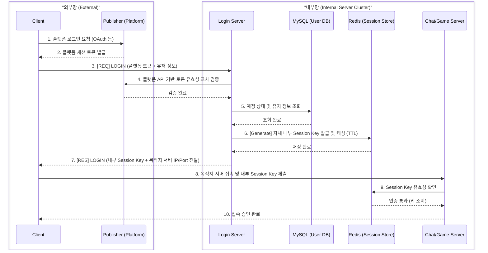

# 🌐 전체 시스템 아키텍처 (System Architecture)

## 0. 문서 개요 (Overview)

| 항목 | 상세 내용 |
| :--- | :--- |
| **목적** | 전체 게임 서버 시스템의 조감도 및 서버 간 데이터 흐름 명세 |
| **핵심 구조** | 분산 환경을 고려한 역할별 서버 분리 (로그인, 채팅, 게임) 및 Stateless 세션 관리 |
| **주요 기술** | Custom Network Core (IOCP), Redis (Global Cache), MySQL, Publisher Auth 연동 |

---

## 1. 시스템 전체 구성도 (System Overview)

시스템은 확장성과 관심사 분리를 위해 역할별로 서버를 분리하여 설계했습니다.

### 🔹 각 컴포넌트의 역할
*   **네트워크 코어 (Network Core):** 모든 서버의 통신 뼈대가 되는 커스텀 비동기(IOCP) C++ 라이브러리.
*   **로그인 서버 (Login Server):** 외부 퍼블리셔(플랫폼) 인증 대행, DB 데이터 검증 및 자체 내부 세션 키 발급.
*   **채팅 서버 (Chat Server):** 실시간 채팅 패킷 중계, 공간(그리드) 분할 기반의 메시지 브로드캐스팅.
*   **게임 서버 (Game Server):** N x N 섹터 기반 게임 컨텐츠 서버, 3x3의 주변 섹터의 정보를 전파.
*   **Redis (Session Cache):** 로그인 서버에서 발급한 유저의 **내부 Session Key**를 중앙 집중형으로 저장하는 글로벌 인메모리 캐시. 이를 통해 다른 서버(채팅/게임)에서 메모리를 공유하지 않고도 유저의 인증 상태를 빠르게 검증할 수 있습니다.
*   **MySQL (User DB):** 영구적인 유저 계정, 프로필 및 게임 데이터 저장.

---

## 2. 서버 간 상호작용 (Inter-Server Flow)

각 분산 서버가 독립적으로 작동하면서도 인증 상태를 어떻게 안전하게 공유하는지 보여주는 핵심 시나리오입니다.

### 2.1 통합 인증 및 세션 확립 파이프라인

게임 클라이언트가 외부 플랫폼 인증을 거쳐 내부 분산 서버(채팅 등)에 접속하기까지의 전체 흐름입니다.

#### 흐름 요약
1.  **플랫폼 인증:** 클라이언트는 퍼블리셔(구글, 스팀 등) 플랫폼 로그인을 선행하여 외부 세션 토큰을 발급받습니다.
2.  **교차 검증 및 DB 조회:** 로그인 서버는 전달받은 토큰을 퍼블리셔 API로 검증한 뒤, MySQL에서 유저 정보를 확인합니다.
3.  **내부 세션 발급:** 검증이 완료되면 로그인 서버는 자체적인 **내부 전용 Session Key**를 생성해 Redis에 적재하고 클라이언트에게 반환합니다.
4.  **Stateless 접속:** 클라이언트는 발급받은 내부 Key를 들고 채팅/게임 서버에 접속하며, 각 서버는 Redis를 통해 유효성을 검증하고 연결을 최종 수락합니다.

---

## 3. 🔗 상세 문서 링크 (References)

전체 시스템을 구성하는 각 모듈의 상세한 설계 원리, 프로토콜, 성능 지표는 아래 개별 문서를 확인해 주세요.

*   **[Core]** [네트워크 라이브러리 아키텍처 및 코어 상세](../1.%20NetworkLibrary/README.md)
*   **[Server]** [로그인 서버 (인증 파이프라인 및 DB 연동)](../2.%20Servers/LoginServer/README.md)
*   **[Server]** [채팅 서버 (공간 분할 동기화 및 다채널 전파)](../2.%20Servers/ChatServer/README.md)
*   **[Server]** [게임 서버 (3x3 주변 섹터 기반 행동 전파)](../2.%20Servers/GameServer/README.md)
