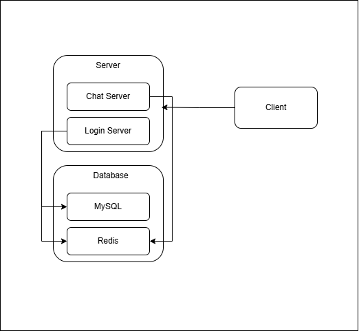

# 전체 시스템 아키텍처 (System Architecture)

본 문서는 게임 서버 포트폴리오의 전체 시스템 조감도입니다. 각 서버 컴포넌트 간의 관계와 통신 흐름을 중심으로 설명합니다.

---

## 1. 시스템 전체 구성도 (System Overview)

### 각 컴포넌트의 역할
- 네트워크 코어: 모든 서버의 통신 기반이 되는 커스텀 고성능 C++ 라이브러리
- 로그인 서버: 계정 인증
- 채팅 서버: 실시간 패킷 중계, 공간(그리드) 분할
- Redis (Session Cache): 로그인 서버에서 발급한 유저의 Session Key를 중앙 집중형으로 저장하여, 다른 서버(채팅/게임)에서 해당 유저의 인증 상태를 빠르게 검증할 수 있도록 지원하는 인메모리 캐시
- MySQL: 영구적인 계정 및 게임 데이터 저장

---

## 2. 서버 간 상호작용 (Inter-Server Flow)

- 각 서버가 독립적으로 작동하면서도 어떻게 협력하는지 보여주는 핵심 시나리오입니다.

### 2.1 인증 및 세션 확립 흐름

서버 외부
- Client > Publisher Login : 클라이언트는 퍼블리셔 플랫폼 기반 로그인을 진행하고, 퍼블리셔에서 제공하는 세션 키를 받는다.

서버 내부
- Client > Login Server : 퍼블리셔에서 제공한 세션 키와 유저 정보를 로그인 서버로 전송한다.
- Login Server > Publisher DB : 퍼블리셔에서 제공하는 API를 기반으로 세션 키를 검증한다.
- Login Server > User DB (MySQL) : 유저 정보를 기반으로 DB를 확인한다.
- Login Server > Session Key DB (Redis) : 새로운 세션 키를 만들어 Redis에 저장한다.
- Login Server > Client : 새로운 세션 키를 클라이언트에게 전송한다.
- Client > Chat Server : 세션 키를 채팅 서버로 전송한다.
- Chat Server > Session Key DB (Redis) : 세션 키를 비교하고 접속을 진행한다.

---

## 3. 상세 문서 링크 (References)

전체 시스템을 구성하는 각 모듈의 상세한 설계 원리, 프로토콜, 성능 지표는 아래 개별 문서를 확인해 주세요.

- [Core] [고성능 네트워크 라이브러리 아키텍처](../../1.%20NetworkLibrary/README.md)
- [Server] [로그인 서버 (인증/DB 연동)](../../2.%20Servers/ChatServer/README.md)
- [Server] [채팅 서버 (다채널/동기화)](../../2.%20Servers/LoginServer/README.md)
