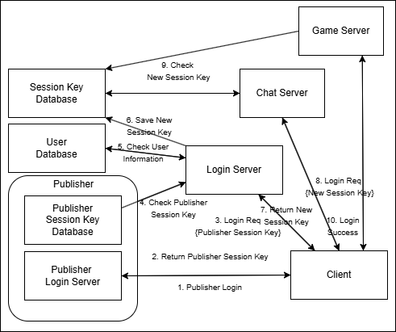

# 🎮 MMORPG Server Portfolio

**C++로 구현한 게임 서버 프로그래머 포트폴리오**

## 1. 프로젝트 개요 (Overview)

MMORPG 서버 프로그래머 직무 지원을 위해 제작된 포트폴리오 메인 문서입니다. 

네트워크 비동기 통신 코어 라이브러리를 직접 설계 및 구현하였으며, 이를 기반으로 로그인 및 채팅 서버를 구축했습니다. 대규모 트래픽 환경에서의 동시성 처리, I/O 성능 최적화에 중점을 두고 개발하였습니다.

## 2. 프로젝트 구조 (Project Structure)

### 2.1 네트워크 라이브러리 (Network Core)

**[🔗 네트워크 컴포넌트 상세 문서](1.%20NetworkLibrary/Components)** | **[🔗 네트워크 코어 종합 문서](1.%20NetworkLibrary/README.md)**

| 컴포넌트 & 기능 | 기술 명세 및 특징 |
| :--- | :--- |
| **직렬화 버퍼 (Serialization)** | 동일한 메시지의 재사용을 통해 불필요한 메모리 할당/해제를 방지하고 I/O 오버헤드를 줄입니다. |
| **수신용 링버퍼 (Ring Buffer)** | 네트워크 파편화로 인해 분절된 미완성 패킷을 안전하게 보관하고 온전한 패킷으로 재조립합니다. |
| **송신용 락프리 큐 (Lock-Free)** | CAS(Compare-And-Swap) 연산 기반으로 대기열을 구현하여, 직렬화 버퍼의 주소를 `WSASend`에 락 대기 없이 즉시 전달합니다. |
| **TLS 메모리 풀 (Memory Pool)** | 스레드별(Thread-Local Storage)로 독립적인 메모리 풀을 할당하여, 잦은 동적 할당 시 발생하는 멀티스레드 병목 현상을 제거합니다. |
| **보안 및 세션 제어** | IP 및 Port 기반의 White IP 필터링을 지원하며, 고유 세션 키를 발급하여 클라이언트의 라이프사이클(접속/해제)을 안전하게 추적합니다. |

### 2.2 로그인 서버 (Login Server)

**[🔗 로그인 서버 상세 문서](2.%20Servers/LoginServer/README.md)**

| 핵심 기능 | 아키텍처 및 구현 특징 |
| :--- | :--- |
| **인증 파이프라인** | 외부 퍼블리셔 DB 및 자체 MySQL 접근을 가정한 멀티스텝 로그인 검증을 수행합니다. |
| **글로벌 캐시 동기화** | 인증이 완료된 유저에게 일회성 세션 키(OTP)를 발급하고 Redis에 적재하여, 다른 서버와 상태를 공유하는 Stateless 구조를 확립했습니다. |

### 2.3 채팅 서버 (Chat Server)

**[🔗 채팅 서버 상세 문서](2.%20Servers/ChatServer/README.md)**

| 핵심 기능 | 아키텍처 및 구현 특징 |
| :--- | :--- |
| **호모지니어스 멀티스레딩** | 모든 워커 스레드가 동일한 로직(Job)을 처리하는 호모지니어스(Homogeneous) 구조를 채택하여, 코어 수에 비례하는 선형적인 성능 확장을 기대합니다. |
| **분산 서버 인증 처리** | 클라이언트가 제출한 세션 키를 Redis에서 교차 조회하여, 로그인 서버를 정식으로 거친 유저인지 빠르게 검증합니다. |
| **공간 분할 브로드캐스팅** | 전체 월드를 섹터(Sector) 단위의 그리드로 분할하여, 유저가 속한 시야 반경(주변 섹터)에만 메시지를 전송함으로써 O(N^2)의 패킷 폭주를 방지합니다. |

## 3. 전체 시스템 아키텍처 (System Architecture)

**[🔗 서버 구조 및 통신 흐름 상세 문서](3.%20Integration%20%26%20Demo/ServerArchitecture.md)**

각각 독립적으로 구동되는 서버들이 Redis 글로벌 캐시와 유저 DB를 매개로 어떻게 안전하게 세션을 확립하고 통신하는지 보여주는 전체 조감도입니다.

